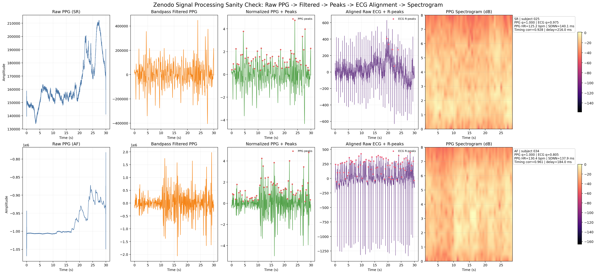
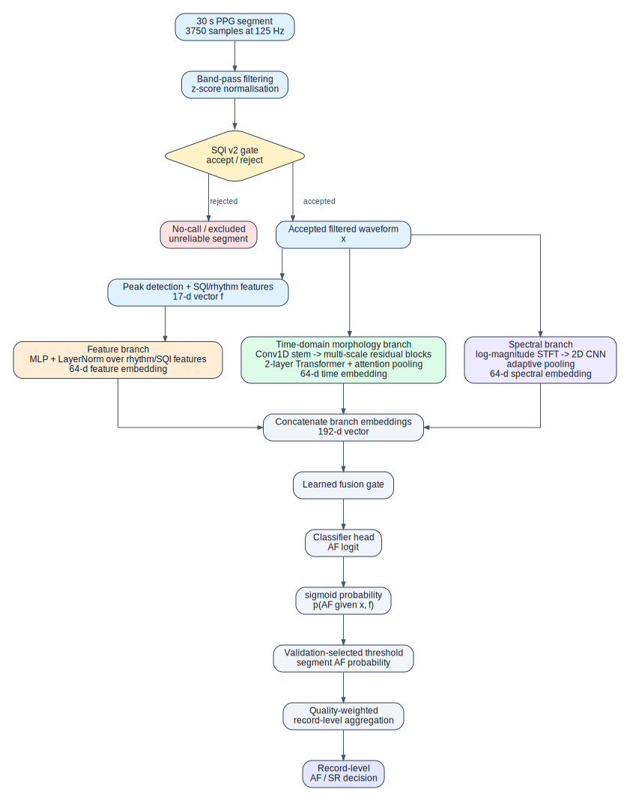
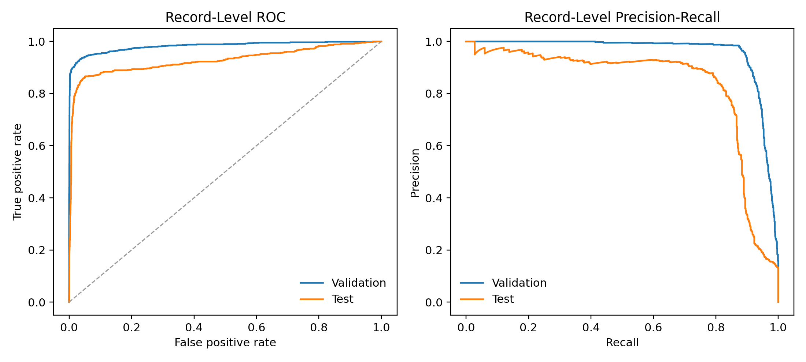
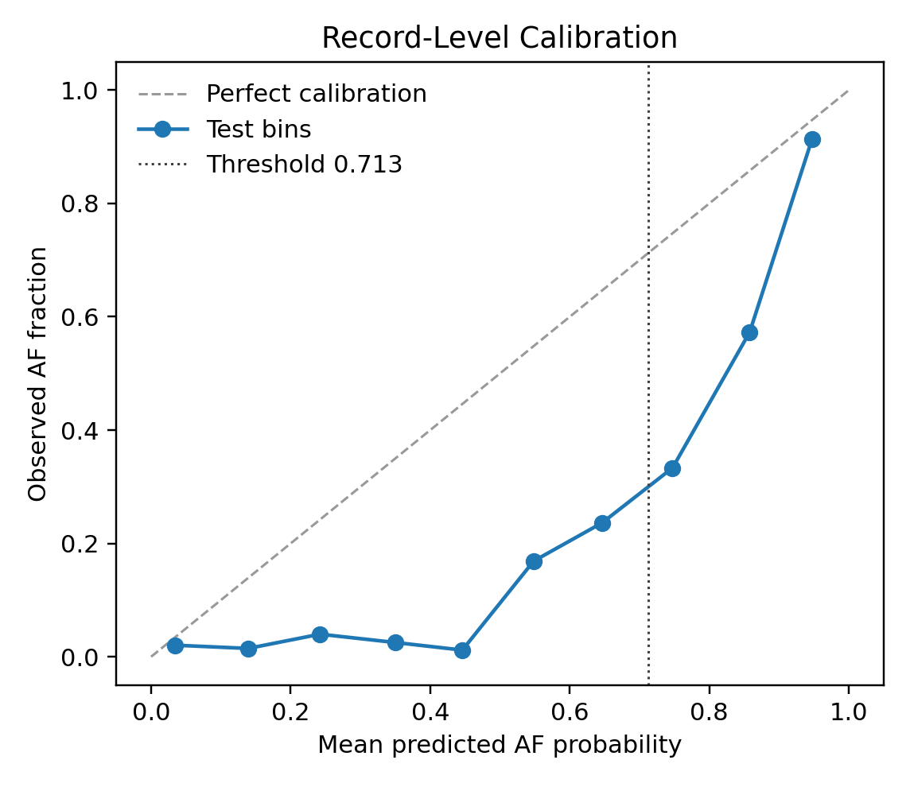
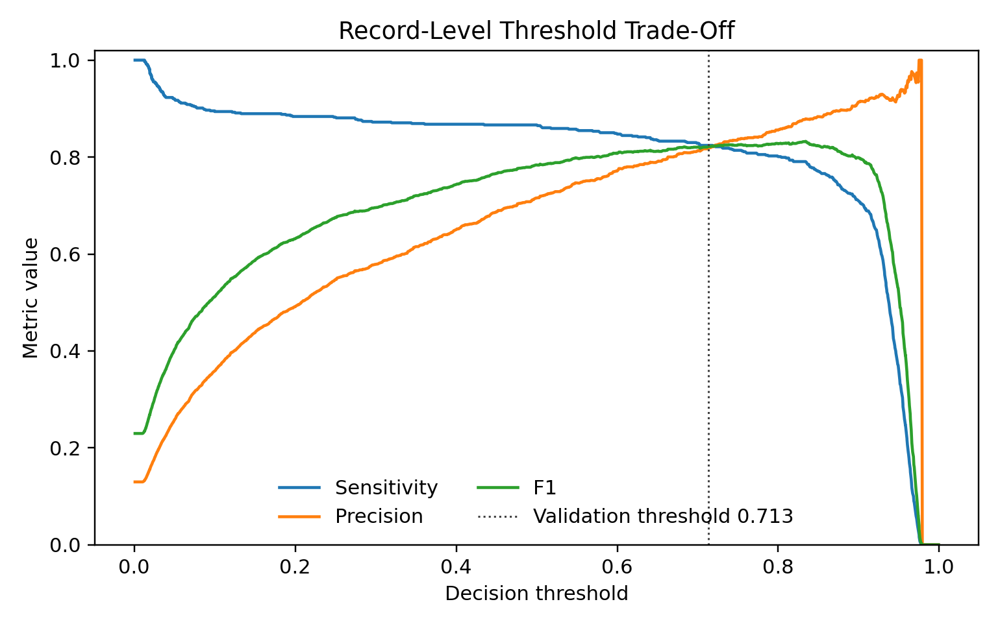
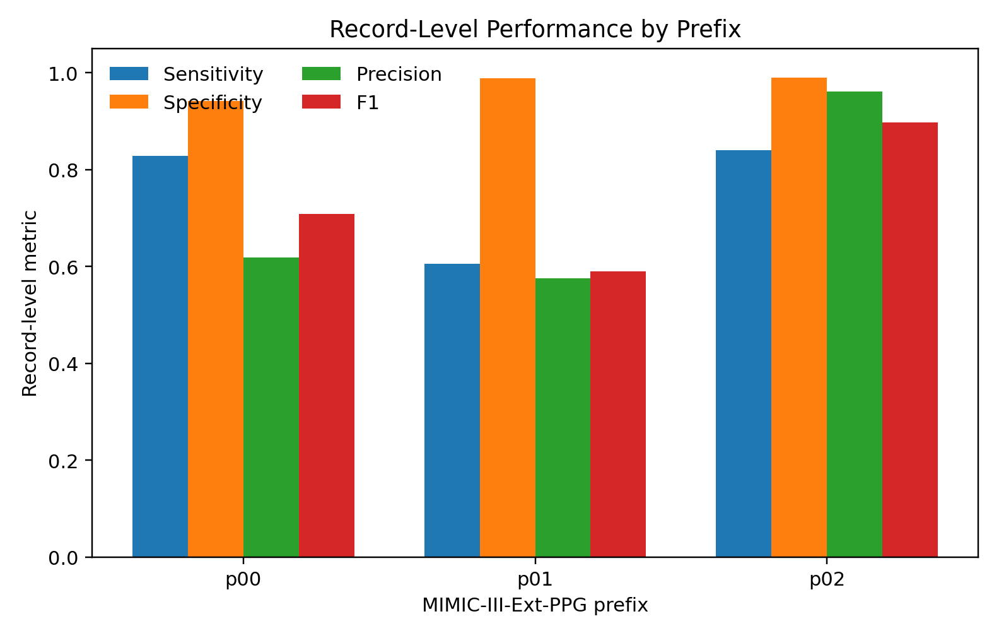
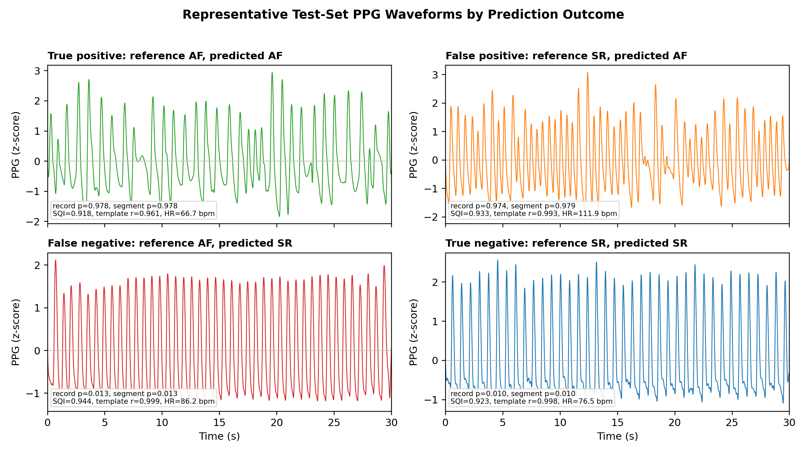
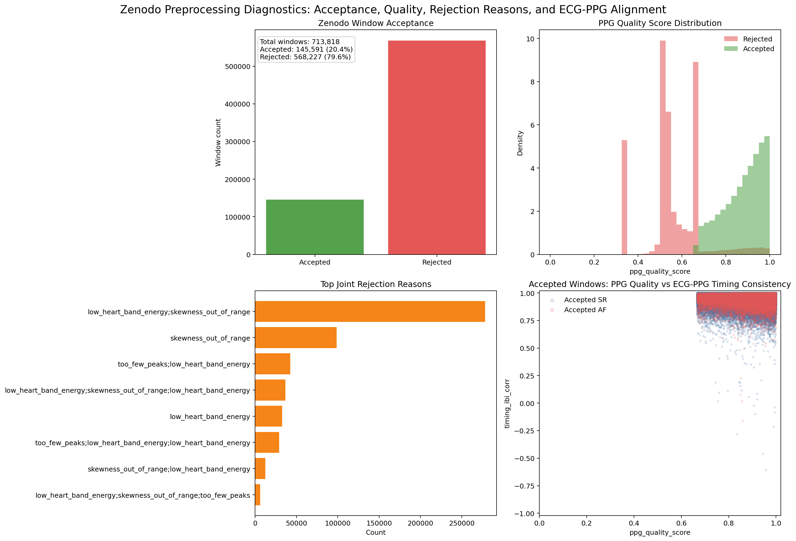

# PPG-Based Atrial Fibrillation Detection with Signal Quality Assessment, Comparative Deep Learning, and Edge AI Deployment

**Author:** Minseok Chey  
**Supervisor:** Dr. Pancham Shukla  
**Co-Supervisor:** Dr. Aakash Soni  
**Second Marker:** Dr. Rolandos Potamias  
**Department of Computing, Imperial College London**

## Acknowledgements

I would like to thank Dr. Pancham Shukla, my supervisor and personal tutor, for his guidance and support throughout this project.

I would also like to thank Dr. Aakash Soni, my industry supervisor, for his advice, direction, and support, and for giving me the opportunity to work on this project with August International Limited, the project's industry collaborator.

## Abstract

Atrial fibrillation (AF) is the most common sustained cardiac arrhythmia and is associated with increased risk of stroke, heart failure, and mortality. Electrocardiography (ECG) remains the clinical diagnostic standard, but intermittent ECG can miss asymptomatic or paroxysmal episodes. Photoplethysmography (PPG) offers a scalable route for continuous rhythm screening, but it is an indirect optical measurement of peripheral blood volume and is sensitive to motion artefacts, low perfusion, poor contact, and non-AF irregular rhythms.

This project develops and evaluates a signal-quality-aware PPG AF screening pipeline on 30-second windows from MIMIC PERform AF and the p00-p02 subset of MIMIC-III-Ext-PPG v1.1.0. The common signal-processing foundation consists of band-pass filtering, z-score normalisation, pulse-peak detection, rhythm and morphology feature extraction, explicit signal quality assessment (SQI), and record-level aggregation. On top of this foundation, the thesis evaluates a reference gated-fusion model and five complementary strategy families for improving PPG-based AF screening.

The reference model, `RhythmMorphologyFusionNet`, combines time-domain waveform morphology, log-magnitude STFT evidence, and a 17-feature rhythm/quality vector using SQI-conditioned gated fusion. The five comparative strategies are: `QA-BeatFormer`, a beat-aware Transformer that represents each PPG segment through beat-level morphology, rhythm, and SQI tokens; `PrecisionGuard-MIL`, a record-level verifier that uses multiple segment classifiers, SQI, and rhythm summaries to reduce false positives; ECG-supervised PPG distillation, where paired ECG-derived rhythm information is used during training while inference remains PPG-only; self-supervised PPG pretraining followed by supervised fine-tuning; and calibration with selective classification, which introduces an explicit high-confidence automatic-decision mode and an inconclusive state.

MIMIC PERform AF is used as a small controlled sanity check, while the main large-scale evaluation uses MIMIC-III-Ext-PPG p00-p02. After SQI filtering, the binary AF-versus-sinus-rhythm p00-p02 subset contains 789,864 accepted segments and 52,419 record-event groups. The reference SQI-conditioned gated-fusion model achieved record-event-level test accuracy 0.9536, sensitivity 0.8241, specificity 0.9729, precision 0.8194, F1 0.8217, AUROC 0.9272, and AUPRC 0.8365 at a validation-selected threshold. Comparative results show that the strongest full-coverage record-level result was obtained by ECG-supervised PPG distillation with median aggregation, reaching F1 0.8740, precision 0.9209, sensitivity 0.8316, specificity 0.9819, AUROC 0.9705, and AUPRC 0.9344 on the held-out test fold. SSL-pretrained PPG fine-tuning achieved record-level F1 0.8289, AUROC 0.9651, and AUPRC 0.9358 under its validation-selected aggregation rule. Post-hoc selective classification further showed that a calibrated high-confidence operating mode can reach F1 0.8817 at 80% coverage and F1 0.9222 at 50% coverage, at the cost of abstaining on lower-confidence records.

The results support three conclusions. First, PPG-only inference can provide useful retrospective AF-versus-SR screening evidence when signal quality, repeated-window aggregation, and decision thresholds are handled explicitly. Second, the strongest improvements are not produced by one architectural trick alone; they arise from complementary decisions about representation learning, training supervision, record-level verification, calibration, and abstention. Third, the most clinically relevant gains come from reducing false positives at the record level rather than simply increasing segment-level sensitivity. A compact 17-feature Nordic Edge AI model is also integrated into Zephyr firmware as an embedded deployment-path smoke test. The study remains retrospective, limited to p00-p02 and binary AF/SR evaluation, and requires full-release, multi-rhythm, external, hardware, and prospective ECG-confirmed validation before clinical use.

## Keywords

Atrial fibrillation; photoplethysmography; signal quality index; deep learning; self-supervised learning; ECG-supervised distillation; multiple-instance learning; calibration; selective classification; wearable screening; edge AI; MIMIC-III-Ext-PPG; MIMIC PERform AF.

## 1. Introduction

### 1.1 Overview

Atrial fibrillation (AF) is the most common sustained cardiac arrhythmia and is a major risk factor for ischaemic stroke. It is associated with increased risk of heart failure, cognitive decline, and mortality, and many AF-related strokes are preventable when the arrhythmia is detected early enough for follow-up and treatment. AF is typically defined from electrocardiographic evidence of irregularly irregular ventricular response without consistent discernible P-waves over clinically significant rhythm episodes. The practical difficulty is that AF may be asymptomatic or paroxysmal, so short clinical ECG recordings and intermittent ambulatory monitors can miss infrequent episodes.

Electrocardiography (ECG) remains the diagnostic standard because it directly records cardiac electrical activity and allows clinicians to inspect rhythm morphology. However, ECG-based monitoring is not always convenient for continuous long-term screening. Wearable and continuous monitoring devices therefore provide an appealing opportunity to screen for rhythm abnormalities outside the clinic. Photoplethysmography (PPG) is especially attractive because optical pulse sensors are already present in many smartwatches, fitness trackers, and other low-burden devices. Each cardiac contraction produces a peripheral pulse wave, allowing PPG to capture heart-rate and rhythm information without electrodes or active user input during routine passive monitoring.

Large wearable studies have shown that PPG-based irregular rhythm notifications can achieve high positive predictive value when alerts are issued conservatively [16-18]. At the same time, these studies reveal the central trade-off in PPG screening: to avoid false alarms, they often prioritise specificity by rejecting noisy data and requiring sustained irregularity, which can reduce sensitivity for shorter or lower-quality episodes. PPG is also an indirect measure of rhythm. Unlike ECG, it does not directly show atrial electrical activity, P-waves, PR intervals, or QRS morphology. Instead, AF must be inferred from irregular pulse timing, beat-to-beat variability, and pulse morphology. These cues can be informative, but they can also be distorted by motion artefact, poor sensor contact, low perfusion, vasoconstriction, skin and device effects, and ambient light leakage. Non-AF irregular rhythms such as premature atrial contractions, premature ventricular contractions, atrial flutter with variable block, or bigeminy-like patterns can also create irregular pulse intervals that resemble AF in PPG.

This project addresses that challenge by studying a PPG-based AF screening pipeline built around explicit signal-quality handling, comparative deep learning, record-event-level aggregation, post-hoc decision calibration, and a compact deployment path for embedded inference. The work is organised around five research questions:

**RQ1.** Can SQI-aware PPG processing achieve useful retrospective record-event AF-versus-SR screening performance on MIMIC-III-Ext-PPG p00-p02?

**RQ2.** Does record-event-level aggregation improve practical screening behaviour compared with isolated 30-second segment predictions?

**RQ3.** Does the reference SQI-conditioned gated-fusion model provide stable benefit over simpler waveform, spectral, and feature-based alternatives?

**RQ4.** Which of five complementary strategy families, including beat-aware Transformers, record-level MIL verification, ECG-supervised PPG training, SSL pretraining, and calibration/selective classification, most improves the final screening operating point?

**RQ5.** Can the project's 17-feature representation be connected to a feasible embedded inference path?

This work is framed as screening rather than diagnosis. A positive PPG prediction should indicate likely AF and motivate confirmatory assessment, but it should not replace diagnostic ECG. The aim is therefore not to claim ECG-equivalent diagnosis from PPG, but to build and evaluate a robust, signal-quality-aware screening pipeline that can reduce false positives while preserving useful AF sensitivity.

### 1.2 Motivation

The motivation for this project is both clinical and engineering. Clinically, low-burden wearable screening could help identify AF that would otherwise remain undetected between clinic visits. Engineering-wise, wearable deployment imposes two competing demands: the pipeline must be accurate enough to be useful, but compact and reliable enough to be practical under noise, limited resources, and repeated real-world use.

This project focuses on PPG because it is already widely available in wearable hardware and can be collected passively. At the same time, that choice makes the problem harder. PPG is more vulnerable to artefact than ECG, and an AF detector that performs well on curated clean segments may still fail in realistic conditions. The project therefore emphasises preprocessing, peak reliability, signal quality assessment (SQI), and record-event-level evidence aggregation rather than treating the task as a waveform classifier alone.

The project also explores deployment feasibility from the start rather than only reporting retrospective model accuracy. This is included because the intended application is not a cloud-only analysis service, but a wearable or near-sensor monitoring workflow in which rhythm evidence is collected at the physical source. Moving at least part of the inference pipeline closer to the sensor can reduce dependence on continuous connectivity, avoid streaming all raw physiological data to a remote server, and support lower-latency screening or unreliable-signal feedback. These considerations are especially relevant for patient-monitoring devices, where the hardware may be a specific-purpose healthcare device rather than a general consumer smartwatch.

The deployment component is therefore scoped as an engineering feasibility question. The main hybrid model uses waveform, spectral, and feature evidence, while a separate compact 17-feature model is integrated into Zephyr firmware as an embedded inference demonstration. This does not prove that the full research model has been deployed on-device. Instead, it tests whether the feature representation and inference workflow can be connected to the type of constrained embedded environment that would be required for a future wearable system.

### 1.3 Contributions

The main contributions are:

1. A staged experimental design using MIMIC PERform AF as a controlled baseline and MIMIC-III-Ext-PPG p00-p02 as the main large-scale benchmark.
2. A 30-second PPG preprocessing pipeline with band-pass filtering, peak detection, rhythm feature extraction, and explicit SQI-based segment filtering.
3. Implementation and evaluation of `RhythmMorphologyFusionNet`, an SQI-conditioned gated-fusion model that combines raw waveform morphology, STFT spectral evidence, and 17 hand-crafted rhythm/quality features.
4. A comparative model-development study of five complementary screening strategies: `QA-BeatFormer`, `PrecisionGuard-MIL`, ECG-supervised PPG distillation, SSL-pretrained PPG fine-tuning, and calibration/selective classification.
5. A record-event-level aggregation strategy that converts segment probabilities into episode-level predictions using quality-weighted averaging, with an aggregation ablation against mean, median, maximum, top-k pooling, and later method-specific record-level aggregation.
6. Supplementary validation evidence including SQI coverage analysis, feature-level SQI ablation, neural branch ablation, a feature-only logistic baseline, prefix-level reliability analysis, bootstrap confidence intervals, calibration analysis, high-confidence coverage/F1 curves, and post-hoc record-level comparisons for the strategy families.
7. A Nordic Edge AI deployment path using a compact 17-feature model integrated into an nRF9160/Zephyr firmware project with an embedded smoke-test harness, presented as feasibility evidence rather than as a reproduction of the full hybrid research model.

The datasets are intentionally reported separately. MIMIC PERform AF is used as a controlled baseline, while MIMIC-III-Ext-PPG is used as the main large-scale evaluation. The results are not presented as a single mixed-dataset training result because the datasets differ in scale, label provenance, patient context, and acquisition conditions. Combining them without a careful domain-adaptation study would make interpretation less clear rather than stronger.

The research questions are addressed by the following evidence:

| Research question | Main evidence |
|---|---|
| RQ1: SQI-aware AF-versus-SR screening | Sections 3-7: p00-p02 dataset definition, SQI coverage, final hybrid model metrics, CIs, and prefix analysis |
| RQ2: record-event-level aggregation | Sections 6-7: segment-level versus record-event-level results and aggregation ablation |
| RQ3: reference gated fusion versus simpler alternatives | Sections 5-7: neural branch ablation, feature logistic baseline, and comparison with QA-BeatFormer and SSL-pretrained PPG encoders |
| RQ4: five complementary strategy families | Sections 2, 5, and 7: QA-BeatFormer, PrecisionGuard-MIL, ECG-supervised distillation, SSL pretraining/fine-tuning, and calibration/selective classification |
| RQ5: embedded inference path | Section 8: compact 17-feature Nordic Edge AI firmware integration and smoke-test harness |

### 1.4 Report Structure

The remainder of this report is organised as follows. Section 2 reviews the background and related work, focusing on clinical motivation, PPG signal characteristics, prior AF detection approaches, signal-quality handling, beat-aware modelling, MIL, ECG-supervised learning, SSL, calibration, and selective classification. Section 3 describes the datasets used in the project and clarifies why MIMIC PERform AF and MIMIC-III-Ext-PPG are treated separately. Section 4 presents the signal processing and feature extraction pipeline, including segmentation, filtering, peak detection, and SQI criteria. Section 5 describes the reference gated-fusion model and the five comparative screening strategies. Section 6 defines the evaluation protocol and metrics. Section 7 presents the experimental results, including segment-level, record-event-level, record-level, calibration, selective-classification, and error analyses. Section 8 describes the embedded Edge AI integration. Sections 9 to 12 discuss the results, limitations, future work, and final conclusions.

## 2. Technical Background and Related Work

This section gives the technical background needed for the implemented system. It first explains why AF is usually defined using ECG, then describes how PPG can provide an indirect rhythm signal. It then introduces the signal-processing, feature-extraction, signal-quality, and learning concepts used by the final pipeline. The purpose is not to survey every possible AF classifier, but to justify the specific design choices used in this project: 30-second PPG windows, peak-derived rhythm features, spectral analysis, explicit signal quality assessment, hybrid deep learning, and record-event-level aggregation.

### 2.1 Atrial Fibrillation and the ECG Reference Standard

Atrial fibrillation (AF) is the most common sustained cardiac arrhythmia. It is characterised by disorganised atrial electrical activity and an irregularly irregular ventricular response. Clinically, AF matters because it is associated with increased risk of ischaemic stroke, heart failure, cognitive decline, and mortality. Early detection is valuable because many AF-related strokes are preventable when the arrhythmia is identified and followed up appropriately.

The difficulty is that AF is not always continuously present. Paroxysmal AF may begin and stop spontaneously, and many patients are asymptomatic. A short ECG recorded during a clinic appointment may therefore show sinus rhythm even if the same patient experiences AF at other times. This creates a motivation for longer-term monitoring and for low-burden screening systems that can collect rhythm evidence repeatedly outside the clinic.

ECG remains the diagnostic standard because it directly measures the electrical activity of the heart. A sampled ECG waveform can be represented as:

```text
x[k] = x(k / f_s),    k = 0, 1, ..., T - 1
```

where `f_s` is the sampling frequency and `T` is the number of samples in the recording. In ECG, AF can be recognised using electrical rhythm markers such as irregular R-R intervals and absence of consistent discernible P-waves. This is why ECG is the reference modality for clinical diagnosis and for rhythm labels in many benchmark datasets.

In this project, ECG is not used as an input at inference time. The main inference pipeline receives only PPG-derived inputs: the filtered PPG waveform, the log-magnitude spectrogram computed from that waveform, and rhythm/quality features extracted from PPG. The ECG-supervised strategy uses paired ECG-derived information during training as teacher or auxiliary supervision, but the deployed student prediction still uses PPG only. This distinction is important: the project studies PPG-based screening, not an ECG-and-PPG multimodal diagnostic model. The rhythm reference in the main dataset consists of chart-event-derived clinical rhythm annotations linked to waveform windows, not per-window prospectively adjudicated ECG labels.

### 2.2 PPG as an Indirect Rhythm Signal

Photoplethysmography (PPG) is an optical technique for measuring peripheral blood volume changes. A light source illuminates tissue and a photodetector measures changes in reflected or transmitted light caused by pulsatile blood flow. Each ventricular contraction produces a pressure wave that travels through the arterial system, which appears in PPG as a pulse waveform.

PPG is attractive for wearable screening because it is low cost, non-invasive, and already available in many smartwatches, fitness trackers, and clinical pulse sensors. Unlike wearable ECG, it does not usually require the user to actively complete an electrode circuit. This makes it suitable for passive repeated monitoring. Large wearable studies have shown that PPG-based irregular rhythm notifications can identify previously unrecognised AF with high positive predictive value when alerting is conservative [16-18].

The same property that makes PPG convenient also makes it technically difficult. PPG does not measure atrial electrical activity. It cannot directly show P-waves, PR intervals, QRS complexes, or atrial fibrillatory activity. AF must instead be inferred from downstream mechanical evidence:

- irregular pulse-to-pulse intervals,
- variable pulse amplitudes caused by beat-to-beat stroke-volume changes,
- inconsistent pulse morphology,
- changes in spectral concentration and rhythm regularity.

These signals can be informative, but they are not specific to AF. Motion artefact, low perfusion, loose sensor contact, ambient light leakage, sensor pressure changes, vasoconstriction, missed pulse peaks, and duplicate detected peaks can all make a sinus-rhythm PPG segment appear irregular. Non-AF rhythms such as premature atrial contractions, premature ventricular contractions, atrial flutter with variable block, and bigeminy-like patterns can also produce irregular pulse intervals [21]. A robust PPG AF detector must therefore avoid the simple shortcut that "irregularity means AF". It must judge whether the irregularity is physiologically plausible and whether the segment quality is high enough to support classification.

### 2.3 Digital Signal Representation and Preprocessing

The main dataset represents PPG as non-overlapping 30-second waveform segments sampled at 125 Hz. Each input segment therefore contains:

```text
T = 30 * 125 = 3750 samples
x in R^3750
```

The 30-second duration is clinically and technically motivated. Clinically, rhythm-monitoring studies commonly treat AF episodes lasting at least 30 seconds as meaningful. Technically, a 30-second window usually contains enough pulse intervals for rhythm variability features to become informative, while still being short enough to avoid mixing long periods of changing noise or rhythm state. Prior PPG AF work similarly indicates that approximately 20-30 seconds, or 25-40 beats, often provides enough rhythm evidence for discrimination [20].

Raw PPG segments contain baseline drift, high-frequency noise, and artefacts. The implemented preprocessing therefore applies band-pass filtering followed by z-score normalisation. The band-pass stage keeps the frequency range most relevant to plausible pulse waveforms while attenuating slow baseline drift and high-frequency noise:

```text
0.5 Hz <= f <= 8.0 Hz
```

After filtering, each segment is normalised as:

```text
x_norm[k] = (x[k] - mean(x)) / (std(x) + epsilon)
```

This reduces dependence on absolute optical amplitude, which can vary with sensor placement, skin-device coupling, perfusion, and individual physiology. Normalisation is especially important for a neural waveform model because otherwise the model may learn patient- or device-specific amplitude shortcuts rather than rhythm and morphology evidence.

### 2.4 Pulse Peaks and Inter-Beat Interval Features

Many AF-relevant PPG features depend on reliable pulse peak detection. Let the detected pulse peak sample indices be:

```text
p_1, p_2, ..., p_N
```

where `N` is the number of detected peaks in a 30-second segment. The inter-beat interval (IBI) sequence in milliseconds is:

```text
IBI_i = 1000 * (p_i - p_{i-1}) / f_s,    i = 2, ..., N
```

and the corresponding beat-to-beat heart rate is:

```text
HR_i = 60000 / IBI_i
```

AF tends to increase the variability and unpredictability of the IBI sequence. The final feature vector therefore includes several standard rhythm-variability measures. These abbreviations are expanded here because they are used throughout the report:

| Abbreviation | Full name | Meaning in this project |
|---|---|---|
| `IBI` | Inter-beat interval | Time between consecutive detected PPG pulse peaks, in milliseconds |
| `HR` | Heart rate | Beat-to-beat pulse rate derived from IBI |
| `SDNN` | Standard deviation of NN intervals | Overall dispersion of pulse-to-pulse intervals; used here as an IBI variability measure |
| `RMSSD` | Root mean square of successive differences | Short-term beat-to-beat variability between adjacent IBIs |
| `pNN50` | Proportion of NN interval differences greater than 50 ms | Fraction of adjacent IBI differences larger than 50 ms |
| `CV_IBI` | Coefficient of variation of IBI | Relative IBI variability, computed as standard deviation divided by mean IBI |
| `SampEn` | Sample entropy | Regularity or unpredictability of the IBI sequence |

`SDNN`, `RMSSD`, and `pNN50` originate from standard heart-rate-variability analysis over normal-to-normal ECG intervals [23]. In this project they are applied to PPG-derived inter-beat intervals, so they should be interpreted as pulse-interval variability features rather than diagnostic ECG HRV measurements. The implemented definitions are:

```text
SDNN = std(IBI)

RMSSD = sqrt(mean((IBI_i - IBI_{i-1})^2))

pNN50 = count(|IBI_i - IBI_{i-1}| > 50 ms) / count(IBI differences)

CV_IBI = std(IBI) / mean(IBI)
```

These features encode complementary forms of irregularity. `SDNN` captures overall interval dispersion. `RMSSD` emphasises short-term beat-to-beat change. `pNN50` measures the fraction of large successive interval differences. `CV_IBI` normalises interval variability by the mean interval, reducing dependence on absolute heart rate.

The feature vector also includes sample entropy, which measures the unpredictability of the interval sequence and is commonly attributed to Richman and Moorman's physiological time-series formulation [24]. In simplified form:

```text
SampEn(m, r) = -log(A / B)
```

where `B` counts matching subsequences of length `m` within tolerance `r`, and `A` counts matching subsequences of length `m + 1`. A more irregular sequence usually has fewer extended matches and therefore higher entropy. In PPG AF detection, entropy is useful because AF is not only variable but also less predictable than many regularly irregular patterns. However, entropy can also increase when peak detection fails, so it must be interpreted together with signal quality.

These rhythm formulas are therefore not all taken from Elgendi's PPG work. Elgendi is most relevant here for PPG signal analysis and pulse peak detection [11], while the interval-variability measures come from HRV practice [23] and sample entropy comes from nonlinear physiological time-series analysis [24].

### 2.5 Morphology and Signal Quality Features

Pulse timing alone is not sufficient because artefact can create false irregularity. The implemented pipeline therefore also measures morphology and signal quality. Template correlation is used to quantify whether detected beats share a consistent pulse shape. Around each detected peak, a local beat window is extracted and compared with the average beat template. A high template correlation suggests repeated, physiologically plausible pulse morphology; a low value suggests motion artefact, poor contact, or unstable peak detection.

The pipeline also checks whether the detected pulse train is physiologically plausible. Very few peaks may indicate flat signal or missed detection, while too many peaks may indicate noise or duplicate detections. Heart-rate bounds reject implausible pulse rates. Short, long, or outlier-heavy IBI distributions are treated as unreliable because they often indicate peak-detection failure rather than true rhythm.

The final SQI gate combines several criteria:

- plausible peak count and heart-rate range,
- energy concentration in the expected heart-rate band,
- waveform distribution checks such as skewness and kurtosis,
- beat-template correlation,
- short, long, and outlier IBI fractions,
- zero-crossing behaviour,
- SNR-like quality,
- agreement between two peak-detection strategies.

This SQI stage creates an explicit accepted-evidence set before classification. Low-quality windows are rejected rather than forced into an AF/SR decision, which can be interpreted as a no-call or unreliable-signal state in a future deployment. This is important for PPG because a confident prediction on an unreliable segment can be more harmful than withholding a classifier decision. The same quality information is also retained as model input through the 17-feature vector and is used later in quality-weighted record-event-level aggregation.

### 2.6 Frequency-Domain and STFT Features

PPG rhythm information is also visible in the frequency domain. A clean pulse waveform usually has energy concentrated near the heart-rate frequency and its harmonics. Motion artefact, poor contact, and broadband noise can spread energy across less physiologically meaningful frequency bands. This motivates both hand-crafted spectral features and a learned spectral branch in the neural model.

For a discrete signal `x[n]`, the discrete Fourier transform decomposes the signal into frequency components:

```text
X[k] = sum_{n=0}^{N-1} x[n] * exp(-j * 2*pi*k*n / N)
```

A full Fourier transform summarises which frequencies are present but does not show when those frequencies occur. The short-time Fourier transform (STFT) addresses this by applying the transform over overlapping windows:

```text
X[m, k] = sum_n x[n] * w[n - mH] * exp(-j * 2*pi*k*n / N_fft)
```

where `w` is the analysis window, `H` is the hop length, `m` is the time-frame index, and `k` is the frequency-bin index. The implemented spectral branch uses:

```text
S[m, k] = log(1 + |X[m, k]|)
```

This log-magnitude representation compresses large amplitude differences and gives the 2D convolutional spectral encoder a compact time-frequency view of the segment.

Spectral entropy is also included as a hand-crafted feature. If `A_k` denotes spectral energy in frequency bin `k`, a normalised spectral distribution can be written as:

```text
P_k = A_k / sum_j A_j
```

The spectral entropy is:

```text
H = -sum_k P_k * log(P_k)
```

Low spectral entropy indicates energy concentrated in a small number of bands, while high spectral entropy indicates a broader or more disordered spectrum. In this project, spectral entropy is not used alone as an AF marker; it is used as one part of the rhythm/quality feature set and is complemented by the learned STFT branch.

### 2.7 Machine Learning and Deep Learning Approaches for PPG AF Detection

Existing PPG AF detection methods can be grouped into three broad families [15]. The first family is rule-based or feature-based detection. These methods detect pulse peaks, compute interval statistics such as SDNN, RMSSD, pNN50, entropy, and Poincare-style descriptors, and then apply thresholds or simple decision rules. They are lightweight and interpretable, which makes them attractive for wearables, but they depend strongly on peak-detection quality [19].

The second family uses classical supervised machine learning over hand-crafted features. Models such as support vector machines, random forests, logistic models, and related tabular classifiers can combine multiple rhythm and quality features into a learned decision boundary. This is useful when no single feature is sufficient. For example, high interval variability may be more suspicious when the segment also has plausible peak count and good morphology consistency, but less trustworthy when template correlation and detector agreement are poor. The limitation is that tabular models can only use information captured by the engineered features.

The third family uses deep learning. One-dimensional CNNs can learn local pulse morphology from raw PPG waveforms. Sequence models such as recurrent networks or Transformers can compare rhythm evidence across time. Spectrogram-based CNNs can learn frequency-domain structure. Deep learning is useful because not every relevant PPG pattern is easily summarised by hand-crafted features. However, deep models can overfit to dataset-specific acquisition conditions, noise patterns, or patient context if signal quality and evaluation design are not handled carefully [22].

The following comparison summarises how the present work is positioned relative to representative prior studies:

| Study | Signal and setting | Evaluation level | Main idea | Limitation relevant to this project | Relevance to this thesis |
|---|---|---|---|---|---|
| Apple Heart Study [16] | Consumer wearable PPG | Notification / patch follow-up | Conservative irregular rhythm notification | High PPV setting does not directly measure all missed episodes | Motivates screening framing and specificity |
| Huawei Heart Study [17] | Mobile PPG | Notification / clinical follow-up | Large-scale PPG AF screening | Follow-up and alerting workflow differ from segment-level modelling | Shows population-scale feasibility |
| Fitbit Heart Study [18] | Consumer wearable PPG | Notification / ECG patch validation | High-specificity alerting with stationary, persistent irregularity | Conservative criteria can reduce sensitivity for short or noisy episodes | Motivates SQI filtering and accepted-evidence coverage |
| Bashar et al. [19] | Smartwatch PPG | Short-window classification | RMSSD, sample entropy, and ectopy-aware logic | Strong dependence on reliable peak detection and clean windows | Motivates rhythm features and confounder handling |
| Liao et al. [20] | Smartwatch PPG | Segment-level evaluation | Recording-length and arrhythmia-confounder analysis | Window length and confounding rhythms strongly affect performance | Supports 30-second windows and non-AF confounder caution |
| Kudo et al. [22] | PPG arrhythmia classification | Segment-level classification | Learned interval-sequence representations | Deep models still need careful quality and dataset handling | Motivates hybrid learned/engineered representation |
| This project | MIMIC-III-Ext-PPG p00-p02 PPG | Record-event primary, segment secondary | SQI filtering, hybrid waveform/STFT/feature fusion, quality-weighted aggregation | p00-p02 only, AF-versus-SR only, retrospective chart-event labels | Tests a complete SQI-aware PPG screening pipeline |

The same comparison can be summarised by methodological approach:

| Approach | Typical input | Strength | Limitation | How this project differs |
|---|---|---|---|---|
| Feature/rule-based PPG AF detection | IBI, RMSSD, pNN50, entropy | Interpretable and lightweight | Sensitive to peak-detection errors | Uses rhythm features but adds SQI, neural waveform evidence, and record-event-level aggregation |
| Deep waveform models | Raw or filtered PPG waveform | Learns morphology directly | May learn dataset noise or acquisition shortcuts | Adds explicit SQI, feature baselines, branch ablation, and record-event-level evaluation |
| Wearable irregular-rhythm alerts | Repeated PPG windows | Can prioritise high specificity | Conservative alerting may miss shorter or lower-quality episodes | Reports segment versus record-event-level behaviour and SQI acceptance coverage |
| This project | PPG waveform, STFT, and 17 features | End-to-end screening pipeline with deployment path | p00-p02 only, binary AF/SR, retrospective labels | Tests SQI-aware record-event feasibility and embedded feature-model integration |

The final model in this project deliberately combines these ideas rather than choosing only one. The waveform branch learns morphology directly from the filtered PPG signal. The spectral branch learns time-frequency structure from the log-magnitude STFT. The feature branch receives explicit rhythm and signal-quality variables. This hybrid design is appropriate for PPG because AF evidence is distributed across pulse timing, pulse morphology, spectral structure, and segment reliability.

### 2.8 Hybrid Fusion and Record-Event-Level Screening Logic

The implemented classifier, `RhythmMorphologyFusionNet`, estimates the probability of AF for each accepted 30-second segment:

```text
p(AF | x, f) = sigmoid(z)
```

where `x` is the PPG waveform, `f` is the 17-dimensional feature vector, and `z` is the model logit. The model uses three encoders:

```text
h_time = phi_time(x)
h_spectral = phi_spec(x)
h_feature = phi_feat(f)
```

These embeddings are concatenated and passed through a learned gate. In the final reported implementation, `fusion_mode=sqi_conditioned`, so the gate is conditioned on selected SQI-related features in addition to the branch embeddings:

```text
h = [h_time, h_spectral, h_feature]
c_sqi = selected SQI conditioning features
g = sigmoid(W_2 GELU(W_1 [h, c_sqi]))
h_gated = h * g
```

The gate allows the model to change the contribution of waveform, spectral, and feature evidence per segment. This is useful because the most reliable evidence source can vary. A clean segment may benefit strongly from waveform morphology and IBI features, while a noisier accepted segment may require more reliance on quality and spectral evidence.

The final screening decision is not made from a single isolated segment. Segment probabilities belonging to the same `record_id+event_id` group are aggregated using quality-weighted averaging:

```text
p_record_event = sum_i q_i * p_i / sum_i q_i
```

where `p_i` is the model probability for segment `i` and `q_i` is its quality score. This converts 30-second predictions into a record-event-level decision and reduces the effect of isolated false-positive windows. This is closer to a practical wearable alerting system, where an alert should be supported by repeated evidence rather than one noisy window.

### 2.9 Background for the Five Comparative Strategy Families

The project evaluates five complementary strategy families on top of the same PPG signal-processing foundation. They are not all the same type of model. `QA-BeatFormer` is a new segment-level representation model, `PrecisionGuard-MIL` is a record-level verifier, ECG-supervised distillation is a training-supervision strategy, SSL pretraining is a representation-learning strategy, and calibration/selective classification is a decision-layer strategy. Treating them as complementary strategies rather than interchangeable neural architectures keeps the methodology coherent: each one targets a different weakness of PPG-based AF screening.

#### 2.9.1 Beat-Aware Transformer Modelling

AF is fundamentally a rhythm disorder, so a PPG model should be able to compare beats rather than only classify a fixed raw waveform tensor. A generic sample-level model receives a 30-second segment as 3750 samples and must learn pulse events implicitly. A beat-aware model first uses signal processing to identify pulse peaks, then represents the segment as a sequence of beat-centred tokens:

```text
PPG segment -> peak detection -> beat windows -> beat tokens -> sequence model
```

This has two advantages. First, the model's sequence length becomes the number of beats rather than the number of samples, which makes attention more data-efficient. Second, the representation matches the physiology of AF: beat morphology, inter-beat interval variability, and beat-to-beat inconsistency can be modelled directly. In this thesis, `QA-BeatFormer` uses this idea by combining beat waveform embeddings, local rhythm/SQI embeddings, and positional information before applying a Transformer encoder.

#### 2.9.2 Multiple-Instance Learning and Record-Level Verification

Multiple-instance learning (MIL) is well matched to record-level PPG screening [26]. In MIL terminology, a record is a bag and its 30-second segments are instances. The record-level label may be known even when each individual segment is noisy or not equally informative. A mean over segment probabilities assumes all segments are equally reliable, while a maximum is vulnerable to one isolated false-positive window. Attention-based MIL instead learns a weighted combination:

```text
h_i = encoder(z_i)
a_i = softmax(v^T tanh(W h_i))
h_record = sum_i a_i h_i
p_record = sigmoid(classifier(h_record))
```

where `z_i` is a segment-level evidence vector. In this project, `z_i` includes stage-1 model probabilities, probability disagreement, SQI, morphology reliability, rhythm descriptors, and segment position. This design allows the verifier to down-weight low-quality or isolated high-risk segments and place more weight on clean, consistent AF evidence.

#### 2.9.3 ECG-Supervised Privileged Training

ECG-supervised PPG learning is included as a training-time strategy. Paired ECG provides a stronger rhythm reference than PPG peak timing, especially for R-peak intervals and irregularity. The student model still receives PPG-derived inputs at inference, but during training it is guided by ECG-derived teacher features and auxiliary targets such as ECG peak count, ECG IBI variability, PPG-ECG timing agreement, and respiratory coupling where available. This can be interpreted as privileged training: a stronger modality is available during model development, but not required during deployment.

This distinction is central to the clinical framing. ECG-supervised distillation does not claim that the deployed model has ECG access. Instead, it tests whether ECG can teach a PPG-only student to distinguish true rhythm irregularity from optical artefact and AF-like non-AF pulse patterns.

#### 2.9.4 Self-Supervised PPG Pretraining

Self-supervised learning (SSL) is used to exploit the large amount of PPG waveform data before supervised AF fine-tuning. The implemented SSL experiment uses a SimCLR-style contrastive objective [28]. Two augmented views of the same PPG segment are treated as a positive pair, while views from different segments are negatives. The encoder is trained to map positive pairs close together and negatives apart:

```text
z_1 = projector(encoder(augment_1(x)))
z_2 = projector(encoder(augment_2(x)))
L_NT-Xent = contrastive_loss(z_1, z_2)
```

The motivation is that the encoder can learn general PPG morphology, rhythm regularity, and artefact-robust representations before seeing AF/SR labels. After pretraining, the projection head is discarded and the encoder is fine-tuned with a supervised AF classifier. SSL is therefore not a separate deployment modality; it is a representation-learning strategy for the same PPG-only inference problem.

#### 2.9.5 Calibration and Selective Classification

Calibration addresses a different problem. A classifier can rank examples well while still producing poorly calibrated probabilities [27]. For example, a predicted probability of 0.90 should ideally correspond to approximately 90% empirical positive frequency among similar examples. Miscalibration matters in screening because thresholds, risk communication, and selective no-call decisions all depend on the meaning of predicted probabilities. This project therefore evaluates post-hoc temperature scaling, Platt scaling, isotonic regression, and beta-style logistic calibration on validation predictions, then applies the selected calibration to test predictions. Calibration is assessed using Brier score, expected calibration error (ECE), reliability diagrams, and downstream F1 at validation-selected thresholds.

Selective classification introduces an explicit abstention option. Instead of forcing an AF/SR decision for every record, the system can classify high-confidence records and mark lower-confidence records as inconclusive. This is appropriate for PPG because low-quality or ambiguous windows should often trigger repeat measurement or confirmatory ECG rather than an automatic diagnosis. In this project, confidence scores include probability margin, entropy, SQI-weighted margin, model disagreement, and within-record segment agreement. Coverage-F1 curves then report performance at 100%, 90%, 80%, 70%, and lower retained-record fractions.

### 2.10 Design Requirements for This Project

The technical background leads to the following design requirements. First, the classifier should use PPG-derived inputs only at inference time, while treating clinically documented rhythm annotations as retrospective reference labels rather than per-window diagnostic ECG adjudications. Second, the system should operate on short windows that contain enough beats for rhythm analysis; this motivates 30-second segments. Third, peak detection and rhythm features should be combined with morphology and spectral evidence because interval irregularity alone is not specific to AF. Fourth, SQI should be explicit so that unreliable windows can be rejected or down-weighted. Fifth, evaluation should emphasise record-event-level screening behaviour, sensitivity, specificity, precision, F1, AUROC, and AUPRC rather than accuracy alone.

These requirements shape the rest of the report. Section 4 describes the implemented preprocessing, peak detection, SQI, and feature extraction. Section 5 describes the reference hybrid neural architecture and the five comparative strategy families. Section 6 explains why the primary evaluation is record-event-level and why some strategy families require separate record-level interpretation. Section 7 then reports both segment-level and record-level results so that local classifier behaviour, practical screening behaviour, and high-confidence selective decision rules can be interpreted separately.

## 3. Datasets

### 3.1 MIMIC PERform AF: Controlled Baseline

MIMIC PERform AF contains 20-minute ECG and PPG recordings from critically ill adults. In this project, 35 records are used: 19 AF and 16 non-AF. Signals are segmented into 30-second windows, producing approximately 40 windows per 20-minute record. The dataset is used as a controlled baseline because it is small and binary. It is suitable for checking whether the preprocessing and classifier pipeline can separate AF from non-AF under relatively curated conditions, but it is not large enough to support strong generalisation claims.

The dataset is part of the MIMIC PERform datasets, which were extracted from the MIMIC-III Waveform Database and released for PPG beat-detection benchmarking and related physiological signal analysis.

The patient-level split used in the reported baseline experiment is:

| Split | Records | AF records | Non-AF records |
|---|---:|---:|---:|
| Train | 25 | 13 | 12 |
| Validation | 5 | 3 | 2 |
| Test | 5 | 3 | 2 |

### 3.2 MIMIC-III-Ext-PPG v1.1.0: Main Dataset

The main experiment uses MIMIC-III-Ext-PPG v1.1.0, published on PhysioNet on 17 March 2026. The resource is a large-scale, annotated, and quality-assessed PPG benchmark derived from the MIMIC-III Waveform Database Matched Subset and MIMIC-III clinical records. The official PhysioNet citation is:

> Moulaeifard, M., Charlton, P. H., & Strodthoff, N. (2026). MIMIC-III-Ext-PPG: A PPG Benchmark Dataset for Cardiorespiratory Analysis (version 1.1.0). PhysioNet. RRID:SCR_007345. https://doi.org/10.13026/r6k1-xt76

The associated publication is:

> Moulaeifard, M., Kutscher, M., Aston, P. J. et al. MIMIC-III-Ext-PPG, a PPG-based Benchmark Dataset for Cardiovascular and Respiratory Signal Analysis. Scientific Data 13, 668 (2026). https://doi.org/10.1038/s41597-026-07335-8

The full MIMIC-III-Ext-PPG v1.1.0 heart-rhythm task contains:

| Property | Value |
|---|---:|
| Patients | 6,189 |
| Non-overlapping 30-second PPG segments | 6,399,754 |
| Total duration | approximately 53,331 hours |
| Sampling rate | 125 Hz |
| Mean age | 64.1 +/- 17.0 years |
| Mean weight | 82.2 +/- 22.6 kg |
| Mean height | 169.5 +/- 10.5 cm |
| Female patients | 43.9% |

The dataset contains harmonised rhythm labels including SR, sinus tachycardia, AF, sinus bradycardia, ventricular pacing, first-degree AV block, atrioventricular pacing, atrial flutter, atrial pacing, bundle branch block, and less common rhythms. The full label distribution includes 3,950,724 SR segments and 597,769 AF segments.

The rhythm labels should be interpreted carefully. In MIMIC-III-Ext-PPG, each 30-second waveform segment is associated with a harmonised clinical rhythm chart event. The dataset extraction uses waveform data ending at the rhythm chart event time and extending back to the previous rhythm annotation or up to 15 minutes earlier [4, 5]. Therefore, the labels are clinically documented rhythm annotations linked to waveform windows, not direct per-window prospective ECG adjudications. This label provenance is appropriate for large-scale retrospective benchmarking, but it leaves possible timing mismatch and chart-label noise as limitations.

Each segment is stored in WFDB format. PPG is present for all segments, and simultaneous ECG lead II, arterial blood pressure, and respiratory signals are included where available. The metadata also include demographics, clinical information system, ICD-derived diagnosis codes, 10-fold stratification labels, derived HR/RR/BP annotations, and SQI values. The released WFDB waveform signals are raw segmented signals; users are responsible for applying filtering, denoising, and normalisation before model training.

### 3.3 Scope Used in This Project

This project uses prefixes p00, p01, and p02 of MIMIC-III-Ext-PPG. This subset was chosen because it is already much larger than MIMIC PERform AF and was computationally feasible within the project time and available GPU resources. The binary task retains:

- AF segments as the positive class.
- SR segments as the negative class.

Other rhythm classes are not included in the final binary results. This makes the task interpretable as AF versus sinus rhythm rather than general multi-class arrhythmia classification.

The metadata folds are used directly:

| Split | Metadata folds | Accepted segments | SR segments | AF segments | AF fraction | Record-event groups | SR groups | AF groups | Subjects |
|---|---|---:|---:|---:|---:|---:|---:|---:|---:|
| Train | 0-7 | 622,065 | 537,476 | 84,589 | 0.1360 | 41,376 | 33,943 | 7,433 | 757 |
| Validation | 8 | 93,200 | 82,745 | 10,455 | 0.1122 | 5,742 | 4,848 | 894 | 97 |
| Test | 9 | 74,599 | 67,847 | 6,752 | 0.0905 | 5,301 | 4,613 | 688 | 103 |
| Total | 0-9 | 789,864 | 688,068 | 101,796 | 0.1289 | 52,419 | 43,404 | 9,015 | 957 |

For MIMIC-III-Ext-PPG, the primary evaluation unit is the `record_id+event_id` record-event group rather than `record_id` alone, because a single waveform record may contain more than one rhythm chart event. This avoids assigning conflicting labels to the same evaluation group. The shorter term "record-level" is reserved for the MIMIC PERform AF controlled baseline, where each record has one binary label in this project.

Because SQI introduces a pre-classification rejection step, accepted-window performance must be interpreted together with monitoring coverage. The project therefore reports both classification performance on accepted windows and SQI acceptance rates. Coverage on the AF-versus-SR p00-p02 subset was:

| Split | Raw AF | Raw SR | Accepted AF | Accepted SR | Rejected total | AF coverage | SR coverage | Overall coverage |
|---|---:|---:|---:|---:|---:|---:|---:|---:|
| Train | 88,459 | 548,243 | 84,589 | 537,476 | 14,637 | 0.9563 | 0.9804 | 0.9770 |
| Validation | 10,507 | 85,664 | 10,455 | 82,745 | 2,971 | 0.9951 | 0.9659 | 0.9691 |
| Test | 6,846 | 68,999 | 6,752 | 67,847 | 1,246 | 0.9863 | 0.9833 | 0.9836 |

Coverage by prefix was:

| Prefix | Raw segments before SQI | Accepted segments | Rejected segments | Acceptance rate | AF acceptance rate | SR acceptance rate |
|---|---:|---:|---:|---:|---:|---:|
| p00 | 258,847 | 250,651 | 8,196 | 0.9683 | 0.9222 | 0.9754 |
| p01 | 220,105 | 216,476 | 3,629 | 0.9835 | 0.9880 | 0.9827 |
| p02 | 329,766 | 322,737 | 7,029 | 0.9787 | 0.9753 | 0.9791 |

The high acceptance rates show that the final reported performance is not obtained by discarding most windows. However, acceptance is not identical across prefixes or classes; p00 has the lowest AF acceptance rate. This is treated as part of the model's reliability profile rather than ignored.

## 4. Signal Processing and Feature Extraction

This section connects the signal-processing background in Section 2 to the implemented pipeline. The purpose of the preprocessing stage is not only to prepare a waveform for a neural classifier. It also creates the pulse-timing, morphology, spectral, and quality evidence that later determines whether a window is accepted, how it is weighted, and how record-event probabilities are aggregated.

The implemented PPG processing path is:

```text
raw 30 s PPG
-> missing-value interpolation
-> band-pass filtering
-> z-score normalisation
-> pulse-peak detection
-> IBI and rhythm-feature extraction
-> SQI assessment
-> accepted waveform, STFT input, and 17-feature vector
```

This makes the pipeline traceable: every model input is either the normalised waveform itself, a spectral representation computed from that waveform, or a scalar feature derived from the detected pulse train and its signal-quality checks.

### 4.1 Segmentation

All signals are represented as non-overlapping 30-second windows. At 125 Hz, each PPG segment contains:

```text
30 s x 125 Hz = 3750 samples
```

The preprocessing, signal-quality, and hand-crafted feature design follow standard PPG signal-analysis principles, including filtering, pulse-event detection, quality assessment, and pulse-interval feature extraction [11, 25]. The 30-second duration is clinically meaningful because AF episodes of at least 30 seconds are commonly considered significant, and it provides enough beats for IBI-derived rhythm features to be informative.

For MIMIC-III-Ext-PPG, the source dataset already provides 30-second WFDB segments. The project still applies its own filtering, normalisation, SQI processing, and feature extraction because the released waveforms are raw segmented signals.

### 4.2 Filtering and Normalisation

Before filtering, missing samples are linearly interpolated within the segment. A segment containing only missing values is invalid. The filtered signal is then produced with a fourth-order Chebyshev type II band-pass filter applied in second-order-section form with zero-phase forward-backward filtering. The retained band is 0.5-8.0 Hz:

| Parameter | Value |
|---|---:|
| Low cut-off | 0.5 Hz |
| High cut-off | 8.0 Hz |
| Filter type | Chebyshev type II band-pass |
| Filter order | 4 |
| Stopband attenuation | 20 dB |
| Segment length | 30 s |
| Segment stride | 30 s |
| Normalisation | z-score |

The 0.5-8.0 Hz band keeps the frequency range relevant to plausible pulse rates and suppresses slow baseline drift and high-frequency noise. The lower cut-off removes slow baseline wander, while the upper cut-off retains plausible pulse morphology and harmonics without preserving excessive high-frequency noise. The filtering is performed before peak detection because baseline drift and noise can otherwise create false maxima or obscure true pulse peaks.

After filtering, each segment is z-score normalised:

```text
x_norm[k] = (x_filt[k] - mean(x_filt)) / (std(x_filt) + epsilon)
```

If the segment standard deviation is effectively zero, the normalised segment is set to zeros. This prevents absolute optical amplitude from dominating the model, which is important because raw PPG amplitude depends on sensor contact, perfusion, skin-device coupling, and recording conditions. Figure 1 summarises the practical preprocessing and feature-extraction workflow used to convert raw 30-second PPG windows into model inputs and SQI decisions.



*Figure 1. Preprocessing and feature-extraction overview. Raw 30-second PPG windows are filtered, normalised, analysed for pulse peaks and rhythm features, passed through SQI checks, and then converted into waveform, spectral, and feature inputs for model training and inference.*

Additional preprocessing diagnostics are provided in Appendix A.5. They are included as pipeline checks rather than as additional performance results.

### 4.3 Peak Detection

Pulse peaks are detected using an Elgendi-inspired morphology and derivative pipeline. The detector first smooths the normalised PPG using a Savitzky-Golay filter, computes first- and second-derivative cues, and identifies candidate systolic peaks using positive-to-non-positive derivative zero crossings. Each candidate is refined by searching for the local maximum within a 0.2 s neighbourhood. Candidate peaks are retained only if they satisfy amplitude, curvature, prominence, and minimum-distance constraints.

The peak detector is configured with:

| Parameter | Value |
|---|---:|
| Minimum HR | 35 bpm |
| Maximum HR | 220 bpm |
| Prominence scale | 0.3 |
| Minimum absolute prominence | 0.02 |
| Peak refinement radius | 0.2 s |

The minimum peak distance is derived from the maximum plausible heart rate:

```text
minimum_distance_samples = round(f_s x 60 / max_hr_bpm)
```

At 125 Hz and 220 bpm, this prevents duplicate detections that are closer than a physiologically plausible pulse interval. If the derivative-based detector returns too few peaks, the implementation falls back to a prominence-based local-maximum detector.

An alternate prominence-based detector is also used as a consistency check even when the derivative-based detector succeeds. Agreement is computed by matching peaks within a 0.12 s tolerance and dividing the number of matched peaks by the larger peak count:

```text
agreement = matched_peaks / max(number_of_primary_peaks, number_of_alternate_peaks)
```

Low agreement indicates that the pulse train is not stable under small detector changes. This is treated as an SQI problem rather than as rhythm evidence.

### 4.4 SQI Acceptance Criteria

The SQI gate rejects segments that are unlikely to support reliable rhythm analysis. The criteria include peak-count limits, spectral concentration in the heart-rate band, waveform distribution checks, template similarity, IBI plausibility, zero-crossing rate, SNR-like quality, and detector agreement.

Several SQI quantities are computed directly from the normalised waveform. Heart-band energy and SNR-like quality are estimated using Welch power spectral density. The heart-band energy ratio compares power in the expected pulse band with power in the wider analysed band:

```text
heart_band_energy_ratio = power(0.5-3.5 Hz) / power(0.1-8.0 Hz)
```

The SNR-like SQI compares power in the same heart-rate band with the remaining analysed power. Spectral entropy is also computed from the normalised power distribution and later retained as one of the 17 features.

Template correlation measures whether detected beats have a consistent pulse morphology. Around each detected peak, a beat window is extracted using the median peak spacing to choose the left and right context. Beats are z-score normalised, averaged into a template, and correlated with that template. The final template-correlation SQI is the mean finite correlation across beats. A low value suggests unstable morphology, motion artefact, poor contact, or unreliable peak placement.

IBI plausibility is assessed after peak detection. The pipeline computes the fraction of intervals that are too short, too long, or outlying relative to the median IBI. Outliers are detected using a robust median absolute deviation scale. These checks are important because a segment can have the right number of peaks but still contain duplicated, missed, or irregularly placed peaks.

| SQI criterion | Threshold used |
|---|---:|
| Minimum peak count | 15 |
| Maximum peak count | 125 |
| Minimum HR | 35 bpm |
| Maximum HR | 220 bpm |
| Minimum heart-band energy ratio | 0.55 |
| Maximum absolute skewness | 2.0 |
| Maximum kurtosis | 12.0 |
| Minimum template correlation | 0.55 |
| Maximum short IBI fraction | 0.20 |
| Maximum long IBI fraction | 0.20 |
| Maximum IBI outlier fraction | 0.35 |
| Maximum zero-crossing rate | 0.20 |
| Minimum SNR SQI | 1.2 |
| Minimum detector agreement | 0.55 |

A segment is accepted only if none of these rejection checks fires. Rejected segments are not treated as SR; they are treated as unreliable evidence and excluded from the accepted-window classifier evaluation. Accepted segments are stored in `ppg_accepted_segments.npz` and summarised in `ppg_accepted_segment_summary.csv`. Rejected segments remain available in the full segment summary for auditing.

The pipeline also computes a continuous `quality_score` for accepted segments. Each SQI component is converted into a normalised score in `[0, 1]`, where larger is better, and the composite quality score is the average of those normalised components. This score is later used in two places: as a moderate sample weight in the training loss and as the weight for record-event-level probability aggregation. Thus SQI is not only a hard filter; it also affects how strongly accepted windows contribute to the final screening decision.

### 4.5 Hand-Crafted Feature Vector

The main hybrid neural model and the compact Edge AI model use a 17-dimensional feature vector:

| Feature | Description |
|---|---|
| `peak_count` | Number of detected pulse peaks in the 30-second segment |
| `heart_band_energy_ratio` | Spectral energy concentration in the expected heart-rate band |
| `signal_skewness` | Distribution skewness of the filtered PPG segment |
| `template_correlation` | Similarity between individual beats and the average beat template |
| `estimated_hr_bpm` | Estimated heart rate from detected peaks |
| `quality_score` | Composite segment quality score |
| `ibi_count` | Number of inter-beat intervals |
| `mean_ibi_ms` | Mean IBI duration in milliseconds |
| `median_ibi_ms` | Median IBI duration in milliseconds |
| `sdnn_ms` | Standard deviation of IBIs |
| `rmssd_ms` | Root mean square of successive IBI differences |
| `pnn50` | Fraction of successive IBI differences greater than 50 ms |
| `mean_hr_bpm` | Mean beat-to-beat heart rate |
| `std_hr_bpm` | Standard deviation of beat-to-beat heart rate |
| `cv_ibi` | Coefficient of variation of IBIs |
| `sample_entropy` | Entropy measure of rhythm irregularity |
| `signal_spectral_entropy` | Entropy of the PPG spectral distribution |

The vector deliberately mixes rhythm, morphology, and quality information. The rhythm group includes IBI count, mean and median IBI, SDNN, RMSSD, pNN50, mean and standard deviation of beat-to-beat heart rate, coefficient of variation of IBI, and sample entropy. The morphology and quality group includes peak count, heart-band energy ratio, signal skewness, template correlation, estimated heart rate, the composite quality score, and spectral entropy.

Missing feature values occur when a segment has too few detected intervals for a statistic such as sample entropy. Missing values are filled using medians computed on the training split only. Features are then standardised using training-split means and standard deviations, preventing validation or test information from leaking into preprocessing.

This implementation-level detail matters for the interpretation of the later model results. The neural network is not receiving a raw waveform in isolation. It receives a waveform whose reliability has already been assessed, a spectral view of that waveform, and a feature vector whose components correspond directly to the timing, morphology, spectral, and quality concepts introduced in Section 2.

## 5. Model Development and Comparative Methods

### 5.1 Problem Formulation

Each input sample consists of:

- a filtered and normalised 30-second PPG waveform `x` with 3750 samples,
- a 17-dimensional feature vector `f`,
- a binary label `y`, where `y = 1` denotes AF and `y = 0` denotes SR.

The model outputs a logit `z`. The predicted AF probability is:

```text
p(AF | x, f) = sigmoid(z)
```

The classification threshold is selected on the validation set and then fixed for the test set.

Sections 5.2-5.12 describe the reference SQI-conditioned gated-fusion model. Sections 5.13-5.18 then define the five comparative strategy families evaluated on top of the same PPG signal-processing foundation: beat-aware Transformer modelling, record-level MIL verification, ECG-supervised PPG distillation, SSL pretraining/fine-tuning, and calibration with selective classification. This structure presents the later strategies as parallel design choices rather than as minor add-ons to the reference model.

### 5.2 Model Selection Rationale and Mathematical Background

The model was chosen to match the structure of the PPG AF detection problem rather than to maximise architectural complexity. A 30-second PPG segment contains several complementary signals: local pulse morphology, beat-to-beat timing irregularity, frequency-domain concentration or noise, and explicit signal-quality indicators. A feature-only model can capture rhythm irregularity but may miss waveform shape. A pure waveform CNN can learn morphology but may underuse clinically interpretable pulse-rate variability features. A Transformer-only model is also more expensive than necessary for local pulse-shape extraction. The retained hybrid model therefore uses separate branches for morphology, spectrum, and hand-crafted rhythm/quality features before fusing them.

Formally, each segment is represented as a pair:

```text
x in R^T, where T = 3750
f in R^17
y in {0, 1}
```

The classifier estimates the posterior probability of AF:

```text
p(y = 1 | x, f) = sigmoid(z)
```

where the logit `z` is produced by a learned function:

```text
z = psi(phi_time(x), phi_spec(x), phi_feat(f))
```

Here, `phi_time` is the time-domain waveform encoder, `phi_spec` is the spectral encoder, `phi_feat` is the feature encoder, and `psi` is the gated fusion classifier.

The time-domain branch uses multi-scale 1D convolution because PPG pulse morphology is local but not fixed to one temporal scale. Short kernels capture peak shape and upstroke/downstroke structure, while wider and dilated kernels capture longer morphology and rhythm context. A small Transformer encoder is placed after convolutional downsampling so that the model can compare pulse evidence across the full 30-second window without applying attention directly to all 3750 raw samples.

The spectral branch is included because clean pulse rhythms usually concentrate energy around plausible heart-rate frequencies, while motion, poor contact, and detector failure can produce broader or less structured spectra. The model uses `log1p(abs(STFT))` as a compact time-frequency representation and applies a small 2D CNN to learn dominant pulse bands, harmonic structure, and broadband artefact patterns.

The feature branch is included because several AF-relevant quantities are already well described mathematically by rhythm statistics. For example:

```text
SDNN = std(IBI)
RMSSD = sqrt(mean((IBI_i - IBI_{i-1})^2))
pNN50 = count(|IBI_i - IBI_{i-1}| > 50 ms) / count(IBI differences)
CV_IBI = std(IBI) / mean(IBI)
```

These features directly encode irregularity, while quality features such as template correlation and heart-band energy help the classifier decide whether the irregularity is likely physiologic or artefactual.

Finally, the fusion stage is gated rather than simple concatenation. This is appropriate for PPG because the reliability of each information source varies by segment. A clean segment may benefit strongly from waveform morphology and rhythm features, while a noisier segment may require more reliance on explicit quality and spectral evidence. The architecture is therefore selected to match the physiological and signal-processing structure of the task, not only to increase neural network capacity.

### 5.3 `RhythmMorphologyFusionNet` Overview

The main research classifier is `RhythmMorphologyFusionNet`. It is a hybrid architecture designed to combine complementary information:

1. Time-domain pulse morphology from the raw PPG waveform.
2. Frequency-domain rhythm and noise structure from a log-magnitude spectrogram.
3. Explicit pulse-rate variability and quality features from the 17-dimensional vector.

Each branch produces a 64-dimensional embedding. These embeddings are concatenated, passed through a learned gate, and classified by a multilayer head. The model is therefore not a single generic CNN applied to PPG. It is an implemented three-stream architecture in which each stream corresponds to a different view of the same 30-second segment.

```text
30 s PPG waveform -> time-domain CNN + Transformer -> 64-d embedding
30 s PPG waveform -> STFT + 2D CNN                -> 64-d embedding
17 features       -> MLP feature encoder          -> 64-d embedding

Concatenate -> learned gate -> classifier head -> AF logit
```

The implementation-level forward pass is:

| Stage | Input | Operation | Output |
|---|---|---|---|
| Waveform input | `batch x 3750` | Add channel dimension | `batch x 1 x 3750` |
| Time encoder | `batch x 1 x 3750` | Conv1D stem, multi-scale residual blocks, Transformer, attention pooling | `batch x 64` |
| Spectral encoder | `batch x 1 x 3750` | STFT, log magnitude, 2D CNN, global pooling | `batch x 64` |
| Feature encoder | `batch x 17` | Two-layer MLP with LayerNorm and dropout | `batch x 64` |
| Fusion gate | `batch x 196` for the final SQI-conditioned run, consisting of `batch x 192` branch embeddings plus four SQI-conditioning features | Learned sigmoid gates applied to each branch embedding | `batch x 192` |
| Classifier head | `batch x 192` | MLP classifier | `batch x 1` logit |

This architecture follows the design rationale developed earlier in the project: a CNN first extracts local pulse-shape evidence, a compact sequence model captures longer-range rhythm context, and interpretable rhythm/SQI features remain available to the classifier rather than being replaced by an opaque waveform-only model. The final implementation extends that plan into a three-branch fusion model by adding an explicit spectral branch and a learned gate over waveform, frequency-domain, and hand-crafted feature evidence.

The model can be represented in the paper as a three-branch architecture diagram:



*Figure 2. `RhythmMorphologyFusionNet` combines a time-domain morphology branch, a spectral branch, and a 17-feature rhythm/SQI branch. SQI rejects unreliable windows before inference, and accepted segment probabilities are aggregated at record-event-level using quality-weighted averaging.*

### 5.4 Time-Domain Branch

The time-domain branch receives the waveform as a single-channel sequence:

```text
Input shape: batch x 3750
After channel expansion: batch x 1 x 3750
```

It begins with a convolutional stem:

```text
Conv1D(1 -> 32, kernel=15, stride=2)
GroupNorm
SiLU
```

The stem is followed by three multi-scale residual blocks:

| Block | Input channels | Output channels | Stride |
|---|---:|---:|---:|
| Multi-scale block 1 | 32 | 64 | 2 |
| Multi-scale block 2 | 64 | 96 | 2 |
| Multi-scale block 3 | 96 | 128 | 2 |

Each multi-scale residual block has three parallel convolutional branches:

| Branch | Kernel size | Dilation | Purpose |
|---|---:|---:|---|
| Branch 1 | 3 | 1 | Local pulse shape |
| Branch 2 | 7 | 2 | Medium-range morphology |
| Branch 3 | 15 | 3 | Longer pulse and rhythm context |

The branch outputs are concatenated and fused with a 1x1 convolution, group normalisation, SiLU activation, and squeeze-excitation. A residual skip connection is used, with projection when stride or channel count changes. Group normalisation is used instead of batch normalisation because the final training batch size is relatively small, so batch-level statistics may be less stable.

The temporal length is reduced by a factor of two at the stem and at each residual block:

| Stage | Temporal length | Channels |
|---|---:|---:|
| Input | 3750 | 1 |
| Conv stem | 1875 | 32 |
| Multi-scale block 1 | 938 | 64 |
| Multi-scale block 2 | 469 | 96 |
| Multi-scale block 3 | 235 | 128 |

After the convolutional stack, the waveform has therefore been converted into 235 temporal tokens, each with 128 channels. These tokens are passed through a two-layer Transformer encoder:

| Transformer parameter | Value |
|---|---:|
| Model dimension | 128 |
| Attention heads | 4 |
| Feed-forward dimension | 512 |
| Layers | 2 |
| Dropout | 0.1 |
| Activation | GELU |
| Normalisation style | pre-norm |

The Transformer allows the model to relate pulse morphology across the 30-second segment rather than treating each pulse independently. Attention pooling is then used to summarise the temporal tokens:

```text
a_t = Linear(Tanh(Linear(token_t)))
alpha_t = softmax(a_t over time)
h_time = sum_t alpha_t * token_t
```

The pooled 128-dimensional representation is projected to 64 dimensions using:

```text
Linear(128 -> 64)
GELU
Dropout(0.1)
```

### 5.5 Spectral Branch

The spectral branch computes a log-magnitude short-time Fourier transform from the same waveform. The STFT uses:

| STFT parameter | Value |
|---|---:|
| FFT size | 128 |
| Window length | 128 |
| Hop length | 32 |
| Window | Hann |
| Transform | `log1p(abs(STFT))` |

For a 30-second, 3750-sample segment, this produces a compact spectrogram with 65 frequency bins and approximately 118 time frames. This branch helps the model capture periodicity, dominant pulse-rate bands, broadband noise, and spectral irregularity. The spectrogram is processed by a compact 2D convolutional encoder:

```text
Conv2D(1 -> 16, kernel=5x5), GroupNorm, GELU, MaxPool2D
Conv2D(16 -> 32, kernel=3x3), GroupNorm, GELU, MaxPool2D
Conv2D(32 -> 64, kernel=3x3), GroupNorm, GELU
AdaptiveAvgPool2D(1x1)
Flatten
Linear(64 -> 64)
GELU
Dropout(0.1)
```

The output is a 64-dimensional spectral embedding.

### 5.6 Feature Branch

The feature branch embeds the 17 hand-crafted rhythm and quality features using a two-layer multilayer perceptron. Before entering this branch, missing values are filled using training-split medians and all features are standardised using training-split means and standard deviations. This prevents validation or test information from leaking into feature scaling.

```text
Linear(17 -> 64)
LayerNorm(64)
GELU
Dropout(0.1)
Linear(64 -> 64)
GELU
```

This branch gives the model direct access to clinically interpretable rhythm variability information, such as RMSSD, pNN50, and sample entropy, as well as signal-quality cues such as template correlation and heart-band energy.

### 5.7 Gated Fusion and Classifier Head

The three 64-dimensional embeddings are concatenated:

```text
h = [h_time, h_spectral, h_feature]
shape: batch x 192
```

A learned gate is computed from the concatenated representation. In the final reported implementation, the gate receives selected SQI-conditioning features as well as the concatenated branch embedding:

```text
g = sigmoid(W_2 GELU(W_1 [h, c_sqi]))
```

Here `h` has dimension 192 and `c_sqi` has dimension 4, so the final gate controller input has dimension 196. The `c_sqi` vector is taken from the feature vector using the selected SQI-conditioning columns:

```text
c_sqi = [quality_score, template_correlation, heart_band_energy_ratio, signal_spectral_entropy]
```

The 192-dimensional gate is split into three 64-dimensional gates and applied separately:

```text
h_gated = [h_time * g_time, h_spectral * g_spectral, h_feature * g_feature]
```

The purpose of this gating mechanism is to let the model change the relative contribution of waveform morphology, spectral evidence, and hand-crafted rhythm features on a per-sample basis. For example, if the waveform branch is less reliable but the rhythm features are stable, the model can place more weight on the feature embedding. The implementation also supports an `h`-only standard gate when `fusion_mode=standard`, but the retained final SQI run uses the SQI-conditioned gate above.

The final classifier head is:

```text
Linear(192 -> 128)
LayerNorm(128)
GELU
Dropout(0.2)
Linear(128 -> 64)
GELU
Dropout(0.15)
Linear(64 -> 1)
```

The output is a single AF logit.

### 5.8 Training Objective

The final large-scale model uses `QualityAwareFocalLoss`, which combines binary cross-entropy with positive-class weighting, focal modulation, label smoothing, and signal-quality weighting. For each segment `i`, the model produces logit `z_i`, probability `p_i = sigmoid(z_i)`, label `y_i`, and raw quality score `q_i`.

The label smoothing step is:

```text
y_tilde_i = y_i * (1 - epsilon) + 0.5 * epsilon, where epsilon = 0.02
```

The base loss is binary cross-entropy with logits and positive-class weighting:

```text
b_i = -[alpha * y_tilde_i * log(p_i) + (1 - y_tilde_i) * log(1 - p_i)]
```

where `alpha` is the positive-class weight passed to PyTorch's `pos_weight` argument. Focal modulation is then applied using:

```text
p_t_i = exp(-b_i)
focal_i = (1 - p_t_i)^gamma * b_i, where gamma = 1.5
```

The raw segment quality score is clipped to `[0, 1]` and used as a sample weight:

```text
w_q_i = 0.6 + 0.4 * clip(q_i, 0, 1)
```

The final batch scalar loss is therefore:

```text
L = (1 / B) * sum_i w_q_i * (1 - exp(-b_i))^gamma * b_i
```

This means that all accepted segments can contribute to training, but higher-quality segments contribute slightly more strongly. The quality weighting is deliberately moderate: a low-quality accepted segment is not ignored completely, but it has less influence than a high-quality accepted segment.

### 5.9 Class Imbalance Handling

The final SQI run uses a weighted random sampler. The raw training split contains 84,589 AF segments and 537,476 SR segments after SQI acceptance. Instead of training on this raw class ratio, the sampler targets an AF fraction of 0.333333, corresponding approximately to an AF:SR ratio of 1:2 in sampled mini-batches.

This choice was made after observing that strict balancing did not automatically improve performance. A 1:1 sampler can reduce class bias, but it also reduces exposure to diverse SR examples. In an AF screening task, the negative class contains a wide range of normal and artefact-affected pulse patterns. Retaining more SR diversity can improve specificity and precision. The final training configuration therefore uses class-aware sampling rather than complete 1:1 undersampling.

The final training configuration is:

| Parameter | Value |
|---|---:|
| Device | CUDA |
| Epoch limit | 30 |
| Early stopping patience | 10 |
| Epochs run | 18 |
| Best epoch | 8 |
| Batch size | 32 |
| Learning rate | 3e-4 |
| Weight decay | 5e-5 |
| Optimiser | AdamW |
| Scheduler | CosineAnnealingLR |
| Loss | Quality-aware focal loss |
| Focal gamma | 1.5 |
| Label smoothing | 0.02 |
| Balanced sampler | yes |
| Sampler AF fraction | 0.333333 |
| Mixup | disabled |
| Automatic mixed precision | disabled |
| Threshold objective | validation record-event-level F1 |

During each training epoch, batches are loaded with waveform tensors, scaled feature tensors, labels, and raw quality scores. Non-finite values are replaced with safe defaults before inference. Gradients are clipped to a maximum norm of 1.0, the optimiser is AdamW, and the learning rate is updated with cosine annealing after each epoch. Validation is performed at record-event-level using quality-weighted aggregation, and early stopping keeps the checkpoint with the best validation record-event-level F1. This means the retained model is selected for the same level at which the main result is reported, rather than for isolated segment accuracy.

### 5.10 Data Augmentation and Test-Time Augmentation

During training, waveform augmentation is available for the training split. The implemented augmentations include amplitude scaling, Gaussian noise, circular time shift, low-frequency drift, local masking, and mild time warping. These are intended to reduce overfitting to exact waveform shape and improve robustness to realistic PPG variability.

During evaluation, test-time augmentation averages predictions over three temporal shifts:

```text
shifts = (0, -8, 8)
```

This makes the prediction less sensitive to very small alignment changes in the 30-second window.

### 5.11 Record-Event-Level Aggregation

The model produces segment-level probabilities, but the primary evaluation for MIMIC-III-Ext-PPG is record-event-level. Segment probabilities belonging to the same `record_id+event_id` group are aggregated using a quality-weighted average:

```text
record_event_probability = weighted_mean(segment_probabilities, quality_scores)
```

If all quality weights are zero, the arithmetic mean is used. This aggregation is important because an AF screening alert should be based on an episode or recording rather than a single isolated 30-second prediction. It also reduces the effect of occasional false-positive windows.

### 5.12 Threshold Selection

The final decision threshold is selected using validation record-event-level F1. For the final SQI model, the selected threshold is:

```text
threshold = 0.713
```

This threshold is fixed before test evaluation. Test-set threshold sweeps are reported only as analysis and are not used as the primary result.

### 5.13 Comparative Strategy Design

The five strategy families were selected to target different parts of the PPG AF screening problem. PPG false positives can arise from noisy pulse trains, beat-detection errors, AF-like non-AF rhythms, poor probability calibration, and unstable record-level aggregation. A single larger backbone is unlikely to solve all of these. The comparative design therefore separates representation learning, record-level verification, training supervision, pretraining, and final decision policy:

| Strategy | Hypothesis tested | Inference input |
|---|---|---|
| `QA-BeatFormer` | A physiologically structured beat-level representation may model AF rhythm irregularity better than an unstructured segment representation | PPG only |
| `PrecisionGuard-MIL` | A record-level verifier can reduce false positives by checking whether high segment scores are consistent and high quality | PPG-derived model outputs and features |
| ECG-supervised PPG distillation | ECG-derived rhythm supervision during training can reduce noisy PPG label learning while retaining PPG-only inference | PPG only at inference; ECG only during training |
| SSL-pretrained PPG fine-tuning | Unlabelled PPG can teach a more robust representation before supervised AF training | PPG only |
| Calibration and selective classification | Better probability calibration and abstention can improve practical screening decisions without retraining a backbone | PPG-derived predictions |

The reference gated-fusion model remains important because it provides a complete waveform/STFT/feature PPG classifier and a baseline for comparison. The five strategies above are framed equally as complementary attempts to improve screening behaviour. Some modify the segment representation, some modify training, and some modify the final record-level decision. This is intentional: the thesis evaluates a screening system, not only a leaderboard of neural backbones.

### 5.14 `QA-BeatFormer`: Quality-Aware Beat Transformer

`QA-BeatFormer` was implemented to make the neural representation closer to the physiology of AF. Instead of treating the 30-second PPG segment only as a generic waveform, the model detects pulse peaks, extracts beat-centred windows, and represents the segment as a sequence of beat tokens. Each token combines beat morphology, local rhythm context, and quality information:

```text
30 s PPG segment
  -> preprocessing and peak detection
  -> beat-centred windows
  -> morphology encoder for each beat
  -> rhythm/SQI feature embedding
  -> Transformer encoder over beat tokens
  -> attention pooling
  -> AF logit
```

For each detected pulse, a fixed-length beat window is resampled to 128 samples. A shared 1D CNN maps the beat waveform to a morphology embedding. A small MLP maps local rhythm and quality features, such as IBI statistics, quality score, template correlation, and peak reliability, into the same model dimension. The token representation is:

```text
token_i = morphology_i + rhythm_quality_i + position_i
```

A Transformer encoder then models relationships between beats. This is appropriate because AF is not only a local waveform-shape problem; it is characterised by irregular beat-to-beat timing and unstable pulse morphology over a sequence. Attention pooling converts the beat sequence into a segment embedding, which is classified by an MLP head.

The implemented `QA-BeatFormer` is still a PPG-only model. It does not use ECG, demographics, or external clinical variables at inference. Its main design difference from `RhythmMorphologyFusionNet` is the level at which evidence is fused. The original model fuses branch-level waveform, STFT, and feature embeddings. `QA-BeatFormer` fuses morphology, rhythm, and quality at the physiologically meaningful beat-token level.

### 5.15 `PrecisionGuard-MIL`: Record-Level Verifier

A main practical error mode in PPG AF screening is false-positive AF prediction rather than lack of AF sensitivity. `PrecisionGuard-MIL` was therefore implemented as a second-stage record-level verifier. It does not replace the segment classifiers. Instead, it receives their predictions and additional PPG-derived reliability features, then decides whether the record-level evidence is consistent enough to support an AF prediction.

For each segment, the verifier feature vector includes:

- segment probabilities from the gated-fusion model, waveform-only model, and `QA-BeatFormer`,
- probability agreement and disagreement statistics,
- PPG quality score, runtime quality score, template correlation, and heart-band energy ratio,
- estimated heart rate, mean heart rate, heart-rate variability, and sample entropy,
- segment position within the record.

Record-level aggregate features are also included, such as top-k mean probability, maximum probability, fraction of segments above 0.5 and 0.7, mean quality, quality among high-probability segments, and log segment count. A segment encoder MLP embeds each segment vector. Attention pooling then produces a weighted record representation:

```text
h_i = MLP(z_i)
s_i = v^T tanh(W h_i)
a_i = softmax(s_i)
h_record = sum_i a_i h_i
logit_record = classifier([h_record, aggregate_features])
```

Hard-negative emphasis is used during training. Non-AF records that earlier models classify as high-risk AF receive a larger loss weight. In the completed run, 754 hard-negative records were identified and up-weighted by a factor of 3.0. This directly targets the false-positive burden that limited F1 in earlier experiments.

`PrecisionGuard-MIL` is still PPG-derived because all inputs come from PPG segment classifiers and PPG signal-processing features. It is best interpreted as a final screening verifier, not as a new raw waveform backbone.

### 5.16 ECG-Supervised PPG Distillation

The ECG-supervised strategy uses paired ECG information during training to improve a PPG-only student. The motivation is that ECG R-peaks provide cleaner cardiac timing than PPG peaks, while PPG remains the intended deployment signal. This is a teacher-student design:

```text
Training:
  PPG student inputs -> AF classifier
  ECG-derived teacher features -> auxiliary/distillation targets

Inference:
  PPG student inputs only -> AF probability
```

The PPG student uses the same 30-second PPG-derived feature family as the main pipeline, while the teacher side extracts ECG and cross-modal timing descriptors. The teacher feature set includes ECG peak count, ECG heart-band energy ratio, ECG template correlation, ECG-estimated heart rate, ECG IBI statistics, ECG sample entropy, matched PPG-ECG peak count, PPG-ECG timing delay, IBI error, IBI correlation, and respiratory coupling descriptors where available.

The training objective combines three components:

```text
L = L_AF + lambda_distill * L_teacher + lambda_aux * L_aux
```

`L_AF` is the supervised AF/SR classification loss. `L_teacher` encourages the PPG student representation to align with ECG-derived rhythm evidence. `L_aux` predicts selected auxiliary timing and respiratory targets. The completed p00-p02 paired experiment used metadata folds 0-7 for training, fold 8 for validation, and fold 9 for testing. The best epoch was epoch 3, and the validation-selected segment threshold was 0.966.

This method must be described carefully. It is not a PPG-only training method, because ECG is used as privileged information during training. However, it is a PPG-only inference method, because the final classifier does not require ECG at test time. In a practical screening system, this means ECG can help train a better PPG model offline while the deployed wearable still uses only optical PPG.

### 5.17 SSL-Pretrained PPG Encoder and Fine-Tuning

Self-supervised pretraining was implemented to test whether the PPG encoder can learn useful structure from unlabelled PPG before supervised AF/SR fine-tuning. The pretraining stage uses SimCLR-style contrastive learning. For each PPG segment, two augmented views are generated using waveform augmentations such as amplitude scaling, time shift, noise, local masking, drift, and mild time warping. The encoder and projection head are trained using an NT-Xent contrastive loss:

```text
x_a = augment_a(x)
x_b = augment_b(x)
z_a = normalize(projector(encoder(x_a)))
z_b = normalize(projector(encoder(x_b)))
L_SSL = NT_Xent(z_a, z_b)
```

The intuition is that two distorted views of the same physiological segment should have similar representations, while different segments should remain separable. This forces the encoder to learn PPG morphology and rhythm structure that are robust to nuisance transformations.

After pretraining, the projection head is discarded. A supervised AF classifier is attached to the pretrained encoder and fine-tuned on the labelled p00-p02 AF/SR task. The completed MIMIC PPG SSL run used 622,065 training segments and 93,200 validation segments for pretraining. It ran for 30 epochs, selected epoch 28, and achieved best validation contrastive loss 1.2752. The supervised fine-tuning run then used the SSL checkpoint, ran for 10 epochs, selected epoch 6, and evaluated both segment-level and record-level aggregation rules.

### 5.18 Calibration and Selective Classification

The final decision-layer experiments operate on saved model predictions rather than retraining the waveform models. Calibration methods are fitted on validation predictions and then applied to test predictions:

- temperature scaling,
- Platt scaling,
- isotonic regression,
- beta-style logistic calibration.

Several record-level aggregation rules are then compared, including mean, trimmed mean, SQI-weighted mean, top-k mean, and quality-filtered top-k mean. The selected post-hoc full-coverage configuration is the one with the highest validation F1.

Selective classification adds a no-call option. A confidence score is computed for each record, and only the highest-confidence fraction is classified. The rest are marked as inconclusive. The main confidence score retained in the completed analysis is SQI-weighted margin:

```text
confidence = |p_record - 0.5| * mean_SQI
```

This creates a clinically interpretable screening workflow:

```text
high probability + high confidence -> AF alert
low probability + high confidence  -> SR/no AF alert
low confidence or poor quality      -> inconclusive / repeat measurement / ECG follow-up
```

Selective classification is not directly comparable to full-coverage F1 because it changes the denominator by abstaining on uncertain records. It is nevertheless important for PPG screening, where forcing a decision on every noisy record may be less useful than producing fewer but more reliable automatic decisions.

## 6. Evaluation Protocol

### 6.1 Primary and Secondary Evaluation Levels

The primary evaluation for MIMIC-III-Ext-PPG is record-event-level because this better reflects an AF screening workflow while respecting the dataset's `record_id+event_id` label structure. Segment-level evaluation is also reported because it is useful for diagnosing model behaviour on individual 30-second windows.

| Level | Definition | Role in paper |
|---|---|---|
| Segment-level | Each 30-second window is classified independently | Secondary diagnostic analysis |
| Record-event-level | Segment probabilities are aggregated per `record_id+event_id` | Primary performance result |

### 6.2 Metrics

The reported metrics are:

| Metric | Meaning |
|---|---|
| Accuracy | Fraction of all predictions that are correct |
| Sensitivity / recall | Fraction of AF examples detected |
| Specificity | Fraction of SR examples correctly rejected |
| Precision / PPV | Fraction of positive predictions that are true AF |
| F1 | Harmonic mean of precision and sensitivity |
| AUROC | Ranking performance across thresholds |
| AUPRC | Precision-recall ranking performance, important under imbalance |

Because the task is imbalanced, accuracy is interpreted cautiously. The headline model-selection metric is record-event-level F1, because it balances AF detection sensitivity against the false-alert burden captured by precision. Sensitivity, specificity, precision, AUROC, and AUPRC are reported alongside F1 to show the operating-point trade-off and threshold-independent ranking performance.

### 6.3 Threshold Selection and Operating-Point Interpretation

The model outputs probabilities rather than hard labels. A threshold is therefore needed to convert predicted AF probability into an AF/SR decision. In this project, the primary threshold is selected on the validation set by maximising record-event-level F1. This choice is appropriate because the final screening output is record-event-level rather than isolated segment-level, and because F1 balances sensitivity against precision in the presence of class imbalance.

The selected threshold is then fixed before test evaluation. Test-set threshold sweeps are included only for analysis. This distinction is important: a test-best threshold can show how the sensitivity-precision trade-off behaves, but it should not be reported as the primary model result because it uses information from the held-out test set. The main result therefore reflects the threshold that would have been chosen before seeing test labels.

The operating point should be interpreted according to deployment context. A lower threshold increases sensitivity but may create more false positives. A higher threshold improves specificity and precision but may miss more AF-positive record-event groups. Since PPG screening is not diagnostic ECG, a high-specificity setting may be preferable for user-facing alerts, while a higher-sensitivity setting may be more appropriate for clinician-facing triage or retrospective review. The reported threshold is a balanced record-event-level F1 operating point, not the only possible deployment threshold.

### 6.4 Segment-Level, Record-Event-Level, and Episode-Level Reasoning

The interim project design distinguished between segment-level and episode-level evaluation. The final implementation uses record-event groups as the practical episode-level unit because MIMIC-III-Ext-PPG provides 30-second segments associated with rhythm chart events and record identifiers. Aggregating by `record_id+event_id` avoids treating every 30-second window as an independent clinical alert.

Segment-level metrics remain useful because they reveal local classifier behaviour. For example, low segment-level precision indicates that isolated windows may produce false positives. Record-event-level metrics are more important for the final claim because they show whether repeated evidence across a record-event supports a reliable screening decision. This mirrors wearable alert logic, where a system usually should not notify a user based on one noisy or isolated window.

The same principle also explains why record-event-level aggregation is quality-weighted. If a record-event contains many accepted segments, a single false-positive segment should have less influence than a consistent run of high-probability AF segments. If a record-event contains only a small number of accepted segments, the decision is inherently less stable and should be interpreted cautiously.

### 6.5 False Positives, False Negatives, and Screening Risk

False positives and false negatives have different consequences in AF screening. False positives may create anxiety, unnecessary follow-up, or increased clinician workload. False negatives may delay detection of AF. Because PPG is a screening signal, neither error type can be ignored. This is why the paper reports precision, specificity, and sensitivity together.

False positives are particularly important under class imbalance. Even a small false-positive rate can produce many false alerts if the negative class is large. Precision therefore becomes more informative than accuracy when AF prevalence is low. In the final MIMIC-III-Ext-PPG test fold, the record-event-level positive class is smaller than the SR class, so precision and F1 provide a clearer picture of alert usefulness than accuracy alone.

False negatives are also clinically important because missing AF undermines the purpose of screening. However, the acceptable sensitivity depends on how the system is used. A continuous wearable that samples repeatedly over time may still detect a patient across later windows even if one event is missed. A one-off retrospective classifier has less opportunity to recover. This project reports held-out record-event performance and treats prospective longitudinal alert performance as future work.

### 6.6 Coverage and No-Call Behaviour

The SQI gate creates a form of coverage control. Rejected segments are not passed to the classifier as reliable evidence. In deployment terms, this could correspond to a no-call or unreliable-signal state, but the retrospective headline metrics in this paper are conditional on SQI-accepted evidence. This deployment behaviour can improve trust by avoiding forced predictions on corrupted PPG, but excessive no-call behaviour would reduce usefulness because the system would be silent too often.

The current final results are reported on SQI-accepted segments and record-event groups derived from those segments. This makes the classifier evaluation cleaner, but it also means that SQI acceptance is part of the denominator story and must be reported alongside performance. Section 3.3 therefore reports split-level and prefix-level acceptance rates. A deployment study should go further by reporting coverage over continuous streaming time and user states. For example, a high F1 score on 40% of windows would not be equivalent to a slightly lower F1 score on 90% of windows.

### 6.7 Reproducibility Artifacts

The final SQI run saved the following key output files in the experiment output directory:

```text
metrics.json
best_model.pt
training_history.csv
val_segment_predictions.csv
test_segment_predictions.csv
val_record_predictions.csv
test_record_predictions.csv
val_segment_threshold_sweep.csv
test_segment_threshold_sweep.csv
val_record_threshold_sweep.csv
test_record_threshold_sweep.csv
```

### 6.8 Evaluation of Comparative Strategy Families

The comparative strategy families are evaluated using the same train/validation/test fold principle wherever possible: folds 0-7 for training, fold 8 for validation, and fold 9 for testing. However, not every method has exactly the same evaluation unit. This distinction is central to fair interpretation:

| Method family | Main evaluation unit | Reason |
|---|---|---|
| Original gated fusion, branch ablation, `QA-BeatFormer` | `record_id+event_id` record-event groups | Matches the original MIMIC-III-Ext-PPG rhythm-event framing |
| `PrecisionGuard-MIL` | `record_id+event_id` record-event groups | Built directly from stage-1 segment predictions grouped into record-event bags |
| Calibration/selective classification | `record_id+event_id` record-event groups | Uses saved predictions from the existing p00-p02 models |
| ECG-supervised PPG distillation | post-hoc `record_id` groups with record label defined as max segment label | The paired ECG/PPG export contains mixed segment labels within some record IDs, so naive group-mean metrics during training are not meaningful |
| SSL-pretrained PPG fine-tuning | `record_id` groups with validation-selected aggregation | The fine-tuning script exports record-level aggregation files for mean, median, and top-k rules |

This means that the strategy comparison table in Section 7 is a screening-system comparison, not a perfectly controlled architecture-only comparison. The reference gated-fusion and `QA-BeatFormer` results remain the cleanest record-event-level comparison under the same grouping rule. The ECG-supervised and SSL rows are still highly informative because they use the same p00-p02 fold split and PPG-only inference, but their record-level aggregation definitions are reported explicitly so that the reader does not overinterpret them as identical to the original record-event unit.

### 6.9 Reporting Rules for Post-Hoc and Selective Results

The paper separates three kinds of results:

1. **Primary full-coverage test results.** Thresholds and aggregation rules are selected on validation data and then fixed on the test fold.
2. **Analysis-only threshold sweeps.** These show what would be possible at different test thresholds, but they are not used as primary headline results.
3. **Selective-classification results.** These report performance on retained high-confidence records at a specified coverage. They are useful for deployment design but should not be compared as if they classify the full test set.

For calibration and selective classification, the reported full-coverage configuration is the validation-selected global best. For SSL fine-tuning, the main record-level row uses the aggregation method selected by validation F1. For ECG-supervised distillation, the main record-level row uses the validation-selected segment threshold from the training run together with median record aggregation; a separate post-hoc aggregation table is reported so the threshold and aggregation choice are transparent.

## 7. Results

### 7.1 Controlled Baseline: MIMIC PERform AF

The MIMIC PERform AF baseline achieved perfect record-level results on its five-record test split. Segment-level results were also high, but not perfect because individual 30-second windows are noisier than record-level averages.

| Evaluation level | Accuracy | Sensitivity | Specificity | Precision | F1 | AUROC | AUPRC |
|---|---:|---:|---:|---:|---:|---:|---:|
| Segment-level test | 0.9447 | 1.0000 | 0.8625 | 0.9154 | 0.9558 | 0.9980 | 0.9986 |
| Record-level test | 1.0000 | 1.0000 | 1.0000 | 1.0000 | 1.0000 | 1.0000 | 1.0000 |

Record-level confusion matrix:

| | Predicted SR/non-AF | Predicted AF |
|---|---:|---:|
| True SR/non-AF | 2 | 0 |
| True AF | 0 | 3 |

Segment-level confusion matrix at threshold 0.170:

| | Predicted SR/non-AF | Predicted AF |
|---|---:|---:|
| True SR/non-AF | 69 | 11 |
| True AF | 0 | 119 |

These results confirm that the signal processing and hybrid model are capable of identifying AF when the data are relatively controlled and binary. However, the perfect record-level result on MIMIC PERform AF should not be interpreted as evidence of generalisation; it only verifies that the implemented preprocessing and classifier can separate AF/non-AF under a small controlled split.

### 7.2 Large-Scale Experiment Comparison

The main model-development comparison is performed on MIMIC-III-Ext-PPG p00-p02. Record-event-level metrics are used for the headline comparison.

| Experiment | Dataset / Scope | Threshold | Accuracy | Sensitivity | Specificity | Precision | F1 | AUROC | AUPRC |
|---|---|---:|---:|---:|---:|---:|---:|---:|---:|
| Controlled baseline | MIMIC PERform AF | 0.170 | 1.0000 | 1.0000 | 1.0000 | 1.0000 | 1.0000 | 1.0000 | 1.0000 |
| Feature-only logistic baseline | MIMIC-III-Ext-PPG p00-p02 | 0.763 | 0.9374 | 0.8430 | 0.9514 | 0.7214 | 0.7775 | 0.9542 | 0.8142 |
| Initial large-scale hybrid | MIMIC-III-Ext-PPG p00-p02 | 0.516 | 0.9435 | 0.8454 | 0.9582 | 0.7519 | 0.7959 | 0.9229 | 0.8165 |
| Class-aware 1:2 sampler | MIMIC-III-Ext-PPG p00-p02 | 0.781 | 0.9514 | 0.8410 | 0.9680 | 0.7973 | 0.8186 | 0.9467 | 0.8311 |
| Final SQI pipeline | MIMIC-III-Ext-PPG p00-p02 | 0.713 | 0.9536 | 0.8241 | 0.9729 | 0.8194 | 0.8217 | 0.9272 | 0.8365 |

Among the reference p00-p02 model-development runs, the final SQI gated-fusion pipeline gives the strongest record-event-level F1 and precision. Compared with the 17-feature logistic baseline, the final hybrid model improves record-event-level F1 from 0.7775 to 0.8217 and precision from 0.7214 to 0.8194, although the feature-only baseline has slightly higher sensitivity and AUROC. The stronger rhythm-feature logistic condition in Section 7.4 reaches F1 0.8177, so the hybrid model's main advantage is not a large F1 margin over every lightweight baseline. Its clearest gain is a stronger precision-oriented operating point, with precision 0.8194 compared with 0.8017 for the rhythm-feature logistic model with SQI filtering. Compared with the initial large-scale hybrid experiment, the final SQI pipeline improves accuracy, specificity, precision, F1, and AUPRC, while sensitivity decreases from 0.8454 to 0.8241. Because this comparison changes several ingredients at once, it is treated as model-development evidence rather than as an isolated SQI ablation.

Additional exploratory record-event-level architectures were tested but not retained:

| Exploratory model | Record-event-level F1 | AUROC | AUPRC | Interpretation |
|---|---:|---:|---:|---|
| Hierarchical record model | 0.7849 | 0.9486 | 0.7459 | Did not improve over SQI-aware hybrid |
| Record MIL | 0.7558 | 0.9471 | 0.7611 | Lower F1 and precision |
| Record MIL second variant | 0.7864 | 0.9545 | 0.7799 | Better AUROC, lower F1 than final SQI |

### 7.3 Comparative Evaluation of Five Screening Strategies

The main comparative experiment evaluates five strategy families alongside the reference gated-fusion model. The table separates segment-level models from record-level decision strategies and explicitly states the inference signal. All retained strategies use PPG-only inference; ECG-supervised distillation uses ECG only during training.

Segment-level comparison:

| Method | Training strategy | Inference signal | Threshold source | Accuracy | Sensitivity | Specificity | Precision | F1 | AUROC | AUPRC |
|---|---|---|---|---:|---:|---:|---:|---:|---:|---:|
| Final SQI gated fusion | Supervised, quality-aware focal loss | PPG waveform + PPG STFT + PPG features | Validation record-event F1 | 0.9526 | 0.8843 | 0.9594 | 0.6841 | 0.7714 | 0.9525 | 0.7947 |
| `QA-BeatFormer` | Supervised beat-token Transformer | PPG waveform + PPG features | Validation record-event F1 | 0.9475 | 0.9043 | 0.9518 | 0.6513 | 0.7572 | 0.9532 | 0.7602 |
| ECG-supervised PPG distillation | ECG teacher/auxiliary supervision during training | PPG features only at inference | Validation segment F1 | 0.9486 | 0.8650 | 0.9581 | 0.7015 | 0.7747 | 0.9489 | 0.7558 |
| SSL-pretrained PPG fine-tuning | SimCLR PPG pretraining then supervised fine-tuning | PPG waveform + PPG features | Validation segment F1 | 0.9523 | 0.8803 | 0.9594 | 0.6835 | 0.7695 | 0.9562 | 0.8178 |

At segment level, the four strongest approaches are close. ECG-supervised distillation gives the best segment F1 among these rows (0.7747), mainly by improving precision relative to `QA-BeatFormer`. SSL fine-tuning gives the strongest segment-level AUPRC (0.8178), suggesting better precision-recall ranking even though its validation-selected operating-point F1 is slightly below ECG-supervised distillation. `QA-BeatFormer` has high sensitivity (0.9043) but lower precision (0.6513), so it is better interpreted as a high-recall segment detector than as the final false-positive-reduction mechanism.

Full-coverage record-level comparison:

| Method | Inference signal | Aggregation / evaluation unit | Accuracy | Sensitivity | Specificity | Precision | F1 | AUROC | AUPRC |
|---|---|---|---:|---:|---:|---:|---:|---:|---:|
| Final SQI gated fusion | PPG waveform + STFT + features | `record_id+event_id`, quality-weighted mean | 0.9536 | 0.8241 | 0.9729 | 0.8194 | 0.8217 | 0.9272 | 0.8365 |
| `QA-BeatFormer` | PPG beat tokens + features | `record_id+event_id`, model aggregation | 0.9483 | 0.8561 | 0.9621 | 0.7709 | 0.8113 | 0.9467 | 0.8241 |
| `PrecisionGuard-MIL` | Stage-1 PPG model outputs + PPG reliability features | `record_id+event_id`, attention MIL verifier | 0.9442 | 0.8401 | 0.9597 | 0.7565 | 0.7961 | 0.9578 | 0.8373 |
| `PrecisionGuard` baseline top-5 mean | Stage-1 PPG model outputs | `record_id+event_id`, top-5 mean | 0.9477 | 0.8430 | 0.9634 | 0.7744 | 0.8072 | 0.9312 | 0.7571 |
| SSL-pretrained PPG fine-tuning | PPG waveform + features | `record_id`, validation-selected mean aggregation | 0.9243 | 0.9013 | 0.9301 | 0.7672 | 0.8289 | 0.9651 | 0.9358 |
| ECG-supervised PPG distillation | PPG features only at inference | `record_id`, median aggregation | 0.9514 | 0.8316 | 0.9819 | 0.9209 | 0.8740 | 0.9705 | 0.9344 |

The strongest full-coverage record-level operating point is ECG-supervised PPG distillation, with F1 0.8740 and precision 0.9209. This is a meaningful improvement over the reference gated-fusion F1 0.8217, especially because the main gain is precision rather than simply increasing sensitivity. The result supports the hypothesis that training-time ECG supervision can teach a PPG-only student to avoid some AF-like false positives.

The SSL-pretrained PPG encoder also improves the full-coverage record-level F1 to 0.8289 and substantially improves ranking metrics, with AUROC 0.9651 and AUPRC 0.9358. This suggests that contrastive pretraining learned a useful PPG representation even though its operating-point precision did not match ECG-supervised distillation.

`PrecisionGuard-MIL` did not outperform its own top-5 mean baseline at the validation-selected threshold, with F1 0.7961 versus 0.8072 for the top-5 baseline. However, it improved threshold-independent ranking over the top-5 baseline, especially AUPRC (0.8373 versus 0.7571). This means the idea remains useful, but the retained verifier threshold and calibration were not yet optimal for the full-coverage operating point.

The ECG-supervised and SSL rows use post-hoc `record_id` aggregation rather than the original `record_id+event_id` unit. They are therefore reported as screening-level strategy results rather than a perfectly controlled architecture-only comparison. The main conclusion remains valid but bounded: among the five strategies tested, ECG-supervised PPG distillation and SSL pretraining produced the strongest evidence for improved record-level screening performance, while `QA-BeatFormer` and `PrecisionGuard-MIL` were useful exploratory strategies but not the final best operating point.

Post-hoc calibration and selective classification were evaluated using the saved predictions from existing PPG-only models. The best full-coverage post-hoc configuration was waveform-only predictions with isotonic calibration and trimmed-mean aggregation:

| Configuration | Threshold | Test F1 | Precision | Sensitivity | Specificity | AUROC | AUPRC |
|---|---:|---:|---:|---:|---:|---:|---:|
| Waveform + isotonic + trimmed mean | 0.443 | 0.8069 | 0.7701 | 0.8474 | 0.9623 | 0.9366 | 0.8177 |

Calibration improved probability reliability even when full-coverage F1 did not exceed the reference gated-fusion result:

| Model | Validation-selected calibration | Aggregation | Segment ECE before | Segment ECE after | Brier before | Brier after | Test F1 |
|---|---|---|---:|---:|---:|---:|---:|
| Waveform-only | Isotonic | Trimmed mean | 0.0522 | 0.0413 | 0.0414 | 0.0395 | 0.8069 |
| Gated fusion | Platt | Trimmed mean | 0.0758 | 0.0440 | 0.0510 | 0.0414 | 0.8008 |
| `QA-BeatFormer` | Isotonic | Mean | 0.1644 | 0.0445 | 0.0751 | 0.0413 | 0.8038 |

This full-coverage post-hoc model did not beat the original final SQI gated-fusion result. Its value is instead in selective classification. Using SQI-weighted margin as the confidence score, the same calibrated decision layer achieved:

| Coverage | Records retained | Accuracy | Sensitivity | Specificity | Precision | F1 | AUROC | AUPRC |
|---:|---:|---:|---:|---:|---:|---:|---:|---:|
| 80% | 4241 | 0.9724 | 0.8720 | 0.9858 | 0.8916 | 0.8817 | 0.9392 | 0.8299 |
| 70% | 3711 | 0.9752 | 0.8780 | 0.9873 | 0.8955 | 0.8867 | 0.9491 | 0.8389 |
| 50% | 2650 | 0.9845 | 0.9240 | 0.9912 | 0.9205 | 0.9222 | 0.9768 | 0.8870 |

This is one of the most practically important findings. If the device is allowed to abstain on uncertain records, a PPG-only high-confidence mode can achieve much higher F1 and precision than the full-coverage setting. The trade-off is coverage: at 80% coverage, one fifth of records require repeat measurement or ECG follow-up; at 50% coverage, half of records are left inconclusive. For a wearable screening system, this is not necessarily a weakness. A no-call state may be safer than an overconfident prediction on unreliable PPG.

The SSL and ECG-supervised runs also provide useful training details:

| Strategy | Training summary | Selected checkpoint |
|---|---|---|
| ECG-supervised PPG distillation | 617,611 paired p00-p02 PPG/ECG segments; folds 0-7 train, 8 validation, 9 test; 9 epochs run; best epoch 3 | `/vol/bitbucket/mc1920/mimic_ext_paired_physio_distill_20260514_220436/best_model.pt` |
| MIMIC PPG SSL pretraining | 622,065 training PPG segments and 93,200 validation segments; 30 epochs; best validation contrastive loss 1.2752 at epoch 28 | `/vol/bitbucket/mc1920/mimic_ppg_ssl_simclr_20260514_095946/best_model.pt` |
| SSL supervised fine-tuning | Initialised from SSL checkpoint; 10 epochs; best epoch 6; validation-selected segment threshold 0.908 | `/vol/bitbucket/mc1920/mimic_ppg_ssl_finetune_20260515_095109/best_model.pt` |

These artefacts make the comparative strategies reproducible and distinguish completed experimental evidence from proposed future work.

### 7.4 Feature-Level SQI Ablation

To separate part of the SQI contribution from the full hybrid model, a feature-level ablation was run using weighted logistic regression. This ablation does not replace full retraining of the neural waveform/STFT/fusion model, but it tests SQI filtering, SQI-derived features, and quality-weighted aggregation under a consistent lightweight classifier. For each condition, the decision threshold was selected on validation record-event-level F1 and then fixed on the test set.

| Feature-level condition | SQI filtering | SQI features | Quality-weighted aggregation | Threshold | Accuracy | Sensitivity | Specificity | Precision | F1 | AUROC | AUPRC |
|---|---|---|---|---:|---:|---:|---:|---:|---:|---:|---:|
| Rhythm features only, no SQI filter | No | No | No | 0.845 | 0.9507 | 0.8266 | 0.9693 | 0.8011 | 0.8137 | 0.9521 | 0.8126 |
| All 17 features, no SQI filter | No | Yes | No | 0.783 | 0.9413 | 0.8324 | 0.9576 | 0.7461 | 0.7869 | 0.9515 | 0.8109 |
| Rhythm features with SQI filter | Yes | No | No | 0.853 | 0.9517 | 0.8343 | 0.9692 | 0.8017 | 0.8177 | 0.9542 | 0.8132 |
| All 17 features with SQI filter | Yes | Yes | No | 0.759 | 0.9370 | 0.8430 | 0.9510 | 0.7196 | 0.7764 | 0.9543 | 0.8142 |
| All 17 features with full feature-level SQI | Yes | Yes | Yes | 0.763 | 0.9374 | 0.8430 | 0.9514 | 0.7214 | 0.7775 | 0.9542 | 0.8142 |
| Quality features only | Yes | Yes | Yes | 0.668 | 0.8893 | 0.6032 | 0.9319 | 0.5693 | 0.5857 | 0.8462 | 0.6134 |

The ablation shows that SQI filtering modestly improves a rhythm-feature logistic baseline, increasing record-event-level F1 from 0.8137 to 0.8177. Quality-weighted aggregation also gives a small gain for the 17-feature logistic baseline, increasing F1 from 0.7764 to 0.7775. However, simply adding SQI-related features to a linear model does not automatically improve the chosen operating point: the all-feature logistic models have lower precision and F1 than the rhythm-only logistic model, despite similar AUROC and AUPRC. This suggests that SQI is useful as a coverage and reliability mechanism, but that its best use is not necessarily raw linear feature inclusion. Within the reference gated-fusion development stage, the retained final hybrid checkpoint gives the strongest operating-point F1 and precision.

### 7.5 Neural Branch Ablation

To test which neural input stream contributes most strongly, four branch variants were retrained on the same p00-p02 SQI-accepted split: full fusion, waveform-only, spectral-only, and feature-only neural models. For each model, the decision threshold was selected on validation record-event-level F1 and fixed for test evaluation. This is an independent retraining ablation, so the full-fusion row is not the same checkpoint as the retained final SQI model reported in Section 7.6.

| Neural variant | Active input branches | Threshold | Epochs run | Best epoch | Accuracy | Sensitivity | Specificity | Precision | F1 | AUROC | AUPRC |
|---|---|---:|---:|---:|---:|---:|---:|---:|---:|---:|---:|
| Full fusion retrain | waveform + STFT + features | 0.596 | 20 | 10 | 0.9451 | 0.8547 | 0.9586 | 0.7548 | 0.8016 | 0.9298 | 0.7930 |
| Waveform-only | waveform | 0.493 | 28 | 18 | 0.9472 | 0.8517 | 0.9614 | 0.7670 | 0.8072 | 0.9327 | 0.8217 |
| Spectral-only | STFT | 0.531 | 30 | 22 | 0.9345 | 0.8488 | 0.9473 | 0.7062 | 0.7710 | 0.9475 | 0.8128 |
| Feature-only neural | 17 features | 0.606 | 30 | 20 | 0.9306 | 0.8735 | 0.9391 | 0.6814 | 0.7656 | 0.9447 | 0.8135 |

This ablation shows that the waveform branch carries the strongest operating-point evidence among the retrained neural variants, with record-event-level F1 0.8072. The spectral-only and feature-only neural models have similar threshold-independent ranking performance, but lower precision and F1 at their validation-selected thresholds. The independently retrained full-fusion model does not outperform the waveform-only model in this run, even though the retained final SQI checkpoint in Section 7.6 remains the strongest operating point within the reference gated-fusion development stage. The branch ablation therefore supports the importance of learned waveform morphology, but it does not establish a stable additive gain from all three branches under the current training setup. Multiple random seeds and further fusion tuning would be needed before claiming that gated fusion is consistently superior to a waveform-only neural model.

### 7.6 Final SQI Validation and Test Results

The final SQI model stopped early after 18 epochs, with the best validation epoch at epoch 8. The validation-selected threshold was 0.713.

Record-event-level results:

| Split | Accuracy | Sensitivity | Specificity | Precision | F1 | AUROC | AUPRC |
|---|---:|---:|---:|---:|---:|---:|---:|
| Validation | 0.9782 | 0.8736 | 0.9975 | 0.9849 | 0.9259 | 0.9823 | 0.9590 |
| Test | 0.9536 | 0.8241 | 0.9729 | 0.8194 | 0.8217 | 0.9272 | 0.8365 |

Bootstrap 95% confidence intervals were computed on the held-out test record-event predictions. Two intervals are reported: ordinary record-event bootstrap and a more conservative subject-clustered bootstrap, where subjects rather than individual record-events are resampled.

| Metric | Test value | Record-event 95% CI | Subject-clustered 95% CI |
|---|---:|---:|---:|
| Accuracy | 0.9536 | 0.9481-0.9593 | 0.9158-0.9859 |
| Sensitivity | 0.8241 | 0.7935-0.8526 | 0.6652-0.9530 |
| Specificity | 0.9729 | 0.9685-0.9777 | 0.9433-0.9917 |
| Precision | 0.8194 | 0.7918-0.8488 | 0.6683-0.9391 |
| F1 | 0.8217 | 0.7988-0.8438 | 0.6885-0.9310 |
| AUROC | 0.9272 | 0.9114-0.9410 | 0.8471-0.9959 |
| AUPRC | 0.8365 | 0.8080-0.8619 | 0.6726-0.9702 |

The subject-clustered intervals are much wider because the p00-p02 test set contains only 103 subjects. They are therefore a useful reminder that many record-events can still represent a smaller number of individuals.

Segment-level results:

| Split | Accuracy | Sensitivity | Specificity | Precision | F1 | AUROC | AUPRC |
|---|---:|---:|---:|---:|---:|---:|---:|
| Validation | 0.9744 | 0.8329 | 0.9923 | 0.9316 | 0.8795 | 0.9698 | 0.9122 |
| Test | 0.9526 | 0.8843 | 0.9594 | 0.6841 | 0.7714 | 0.9525 | 0.7947 |

There is a visible validation-test gap, especially at record-event-level where F1 decreases from 0.9259 to 0.8217 and AUPRC decreases from 0.9590 to 0.8365. This gap is important because the test fold has lower AF prevalence, different record-event composition, and different prefix mix from the validation fold. The final result is therefore promising held-out p00-p02 evidence, not proof of uniform generalisation across the full MIMIC-III-Ext-PPG release.



*Figure 3. Validation and test record-event-level ROC and precision-recall curves for the final SQI model.*



*Figure 4. Test record-event-level calibration curve using ten probability bins. The vertical dotted line marks the validation-selected threshold of 0.713.*

The corresponding test record-event-level Brier score was 0.0524, and the ten-bin expected calibration error was 0.0663. These values are reported as probability-calibration diagnostics rather than as model-selection criteria; the primary operating point remains the validation-selected F1 threshold.

### 7.7 Confusion Matrices

Record-event-level test confusion matrix at threshold 0.713:

| | Predicted SR | Predicted AF |
|---|---:|---:|
| True SR | 4488 | 125 |
| True AF | 121 | 567 |

Segment-level test confusion matrix at threshold 0.713:

| | Predicted SR | Predicted AF |
|---|---:|---:|
| True SR | 65090 | 2757 |
| True AF | 781 | 5971 |

The record-event-level confusion matrix explains the final positive-class metrics:

```text
Precision = 567 / (567 + 125) = 0.8194
Sensitivity = 567 / (567 + 121) = 0.8241
Specificity = 4488 / (4488 + 125) = 0.9729
F1 = 0.8217
```

### 7.8 Threshold Analysis

The primary threshold is selected on validation data. A test-set threshold sweep is included only to understand the trade-off between sensitivity and precision.

| Threshold | Source | Accuracy | Sensitivity | Specificity | Precision | F1 | FP | FN | TP |
|---:|---|---:|---:|---:|---:|---:|---:|---:|---:|
| 0.713 | Validation-selected | 0.9536 | 0.8241 | 0.9729 | 0.8194 | 0.8217 | 125 | 121 | 567 |
| 0.834 | Test-best analysis only | 0.9587 | 0.7907 | 0.9837 | 0.8788 | 0.8324 | 75 | 144 | 544 |

The higher test-best threshold would reduce false positives from 125 to 75 and increase precision from 0.8194 to 0.8788, but it would also increase false negatives from 121 to 144 and reduce sensitivity from 0.8241 to 0.7907. This confirms that the operating point should be chosen according to intended use.



*Figure 5. Test-set record-event-level sensitivity, precision, and F1 across decision thresholds. The dotted line marks the validation-selected threshold used for the primary test result.*

### 7.9 Aggregation Ablation

Because the final decision is made at record-event-level, aggregation is part of the model design. Using saved segment probabilities from the final SQI model, several aggregation rules were compared. For each rule, the threshold was selected on validation record-event-level F1 and then fixed on the test set.

| Aggregation method | Validation-selected threshold | Test accuracy | Test sensitivity | Test specificity | Test precision | Test F1 |
|---|---:|---:|---:|---:|---:|---:|
| Quality-weighted mean | 0.713 | 0.9536 | 0.8241 | 0.9729 | 0.8194 | 0.8217 |
| Unweighted mean | 0.710 | 0.9532 | 0.8241 | 0.9725 | 0.8170 | 0.8205 |
| Median | 0.675 | 0.9493 | 0.8401 | 0.9655 | 0.7843 | 0.8112 |
| Maximum probability | 0.897 | 0.9402 | 0.8183 | 0.9584 | 0.7457 | 0.7803 |
| Top-5 mean | 0.772 | 0.9419 | 0.8358 | 0.9577 | 0.7468 | 0.7888 |

Quality-weighted averaging gives the best F1 among these aggregation choices, although the gain over a simple mean is small. The larger difference is between averaging-based aggregation and maximum/top-k pooling. Max-style aggregation is more vulnerable to isolated high-probability false-positive windows, which is why it has lower precision and F1.

### 7.10 Per-Prefix Behaviour

Performance differs across p00, p01, and p02:

| Prefix | Records | AF records | Mean accepted segments | Mean quality | Median AF probability | Accuracy | Sensitivity | Specificity | Precision | F1 | AUROC | AUPRC |
|---|---:|---:|---:|---:|---:|---:|---:|---:|---:|---:|---:|---:|
| p00 | 1761 | 180 | 15.26 | 0.9300 | 0.9416 | 0.9302 | 0.8278 | 0.9418 | 0.6183 | 0.7078 | 0.8982 | 0.7413 |
| p01 | 1555 | 38 | 13.22 | 0.9244 | 0.7650 | 0.9794 | 0.6053 | 0.9888 | 0.5750 | 0.5897 | 0.9719 | 0.5783 |
| p02 | 1985 | 470 | 13.69 | 0.9323 | 0.9393 | 0.9542 | 0.8404 | 0.9894 | 0.9611 | 0.8967 | 0.9350 | 0.9134 |

p02 performs best, with F1 0.8967 and precision 0.9611. p01 is the hardest subset: it contains only 38 AF-positive record-event groups in the test split, and sensitivity falls to 0.6053. This prefix-level variability is an important finding rather than only a weakness: it shows that ICU-derived PPG performance depends on data composition and that aggregate p00-p02 performance should not be interpreted as uniform behaviour across all subsets.

The p01 result should be interpreted with particular caution. Its AF support is small, its mean accepted-segment count is slightly lower than p00, its mean quality is the lowest of the three prefixes, and the median AF probability among AF-positive groups is lower than in p00 and p02. These observations do not prove a single cause, but they indicate that p01 may combine low positive support with a distribution shift in accepted evidence.



*Figure 6. Record-event-level sensitivity, specificity, precision, and F1 by MIMIC-III-Ext-PPG prefix. The weaker p01 F1 is shown explicitly rather than hidden by the aggregate p00-p02 result.*

### 7.11 Record-Event-Level Error and Reliability Analysis

A lightweight error analysis was performed using `test_record_predictions.csv` at the validation-selected threshold of 0.713. This does not replace a full ablation study, but it helps identify where the retained model is less reliable.

By quality quartile, the lowest-quality accepted record-events contain most of the missed AF cases:

| Quality-mean quartile | Records | AF records | FP | FN | Sensitivity | Specificity | Precision | F1 |
|---|---:|---:|---:|---:|---:|---:|---:|---:|
| 0.780-0.918 | 1326 | 121 | 14 | 64 | 0.4711 | 0.9884 | 0.8028 | 0.5938 |
| 0.918-0.934 | 1325 | 92 | 27 | 21 | 0.7717 | 0.9781 | 0.7245 | 0.7474 |
| 0.934-0.945 | 1325 | 192 | 38 | 11 | 0.9427 | 0.9665 | 0.8265 | 0.8808 |
| 0.945-0.973 | 1325 | 283 | 46 | 25 | 0.9117 | 0.9559 | 0.8487 | 0.8790 |

By accepted segment count, record-events with only one or two accepted windows have weaker sensitivity, while groups with many accepted windows have higher sensitivity but lower precision:

| Accepted segments per group | Records | AF records | FP | FN | Sensitivity | Specificity | Precision | F1 |
|---|---:|---:|---:|---:|---:|---:|---:|---:|
| 1 | 401 | 129 | 13 | 41 | 0.6822 | 0.9522 | 0.8713 | 0.7652 |
| 2 | 258 | 56 | 2 | 20 | 0.6429 | 0.9901 | 0.9474 | 0.7660 |
| 3-5 | 624 | 97 | 13 | 12 | 0.8763 | 0.9753 | 0.8673 | 0.8718 |
| 6-10 | 869 | 141 | 14 | 14 | 0.9007 | 0.9808 | 0.9007 | 0.9007 |
| 11-20 | 1594 | 162 | 31 | 28 | 0.8272 | 0.9784 | 0.8121 | 0.8196 |
| 21+ | 1555 | 103 | 52 | 6 | 0.9417 | 0.9642 | 0.6510 | 0.7698 |

The error profile also supports the role of quality and coverage:

| Outcome | Records | Mean quality | Mean segment count | Mean probability |
|---|---:|---:|---:|---:|
| True positive | 567 | 0.9404 | 10.47 | 0.9329 |
| False positive | 125 | 0.9368 | 15.45 | 0.8603 |
| False negative | 121 | 0.9165 | 6.73 | 0.2071 |
| True negative | 4488 | 0.9279 | 14.69 | 0.0842 |

False negatives have the lowest mean quality and fewest accepted segments, suggesting that weak or sparse accepted evidence is a major failure mode. False positives have relatively high mean probability and more accepted segments, indicating that some SR record-events show persistent AF-like evidence rather than isolated single-window errors. These analyses are descriptive and partly confounded by prefix mix and AF prevalence, so they guide future ablation and error review rather than providing causal proof.

Figure 7 shows representative high-confidence waveform examples from the held-out test set. These examples are not used for patient-level interpretation and do not contain patient identifiers; they are included only to make the model behaviour more tangible. The false-positive example shows an SR-labelled segment with a transient low-amplitude disturbance and irregular-looking pulse evidence, while the false-negative example is visually regular despite its AF label. This supports the interpretation that some errors are caused by AF-like artefact or regular-looking accepted AF windows rather than by random isolated probability noise.



*Figure 7. Representative 30-second filtered and normalised PPG segments from true-positive, false-positive, false-negative, and true-negative record-events. The examples were selected from held-out test predictions using the validation-selected threshold. They illustrate model behaviour and error modes, not patient-specific clinical conclusions.*

### 7.12 Claim-Evidence-Limitation Summary

The main results support the following bounded claims:

| Claim | Main evidence | Main limitation |
|---|---|---|
| SQI-aware PPG can support AF-versus-SR screening on the evaluated subset | Final record-event-level F1 0.8217, specificity 0.9729, precision 0.8194 | Retrospective p00-p02 scope, binary AF/SR task, chart-event labels |
| Record-event aggregation gives a more useful alert-level summary than isolated windows | Record-event-level precision 0.8194 versus segment-level precision 0.6841 | Not yet a prospective alert-burden or detection-latency study |
| The retained hybrid checkpoint gives a strong reference operating point | Original gated-fusion record-event F1 0.8217 and precision 0.8194 | Branch ablation does not prove stable additive benefit from all fusion branches |
| ECG-supervised PPG distillation gives the strongest full-coverage strategy result | Record-level F1 0.8740, precision 0.9209, specificity 0.9819, AUROC 0.9705 | Uses ECG during training and post-hoc `record_id` aggregation, not pure PPG-only training |
| SSL pretraining improves PPG representation learning | Record-level F1 0.8289, AUROC 0.9651, AUPRC 0.9358 after supervised fine-tuning | Needs consistent record-event evaluation and combination with ECG supervision |
| Selective classification can provide a high-confidence screening mode | F1 0.8817 at 80% coverage and 0.9222 at 50% coverage | Abstains on uncertain records, so coverage must be reported with performance |
| SQI improves reliability interpretation | High accepted-window coverage and explicit deployment no-call interpretation; SQI filtering modestly improves rhythm-feature logistic F1 | Full retrained neural SQI ablation remains future work |
| Embedded inference has a credible feasibility path | Compact 17-feature Nordic/Zephyr smoke-test integration | Precomputed features only; live C feature extraction and clinical hardware validation remain future work |

## 8. Embedded Edge AI Deployment

After evaluating the retrospective PPG models, the project also investigates whether the feature-based part of the pipeline can be connected to an embedded inference workflow. This chapter is placed after the performance results because the deployment work is a downstream implementation step rather than the primary source of model-performance evidence.

### 8.1 Deployment Rationale and Scope

In this thesis, Edge AI means running the trained inference model on or close to the sensing device, rather than sending all raw data to a remote cloud server for analysis. The "edge" is the local embedded device at the boundary between the physical world and the digital system: in this project, a wearable-class nRF9160/Zephyr device connected to the PPG monitoring workflow. This does not mean that model training is performed on the device. Training and model development are performed retrospectively in Python, while the embedded component tests whether a compact trained model can execute locally.

The Edge AI component is included because PPG screening is naturally tied to physical sensing hardware. A practical wearable system would collect PPG at the wrist or another body location, decide whether the signal is usable, and then either provide a local screening output or forward only selected information for review. In that setting, sending every raw waveform window to a cloud server is not always desirable. Connectivity may be intermittent, power is limited, latency matters for user feedback, and physiological data are sensitive. Bringing inference closer to the source is therefore not only an implementation detail; it is part of the practical feasibility of PPG-based monitoring.

This is also relevant to the industry-facing context of the project. The target direction is closer to a specific-purpose patient-monitoring device than to a general-purpose smartwatch application. Such devices need a clear path from retrospective model development to constrained embedded inference, even if the first embedded version is only a compact proof of concept.

The scope of this section is deliberately limited. The embedded work does not claim that the full waveform/STFT/feature fusion model has been reproduced on the device, and it does not provide clinical hardware validation. Instead, it demonstrates that the 17-feature representation can be packaged into a Nordic Edge AI Lab model, linked into a Zephyr firmware project, initialised through the generated runtime API, and exercised with holdout feature vectors. This provides evidence for deployment-path feasibility while keeping the main model-performance claim in Section 7.

| Claim supported by this section | Claim not supported by this section |
|---|---|
| A generated 17-feature model can be linked into the Zephyr firmware path | The full waveform/STFT/feature hybrid model runs on-device |
| The generated runtime API can be initialised and called with holdout feature vectors | Live PPG feature extraction has been validated in firmware |
| Host-side runner behaviour is consistent with the firmware smoke-test pathway | Clinical hardware performance has been proven |
| The project has a credible deployment path for compact feature inference | The embedded model reproduces the retrospective hybrid model's test metrics |

### 8.2 Firmware Target

The embedded component uses the `E2_V3_NCS2.3.0_60115_Copy` firmware project, a Zephyr/nRF Connect SDK application targeting an nRF9160-class device. The firmware includes modules for display, GPS, UART/BLE, power management, IMU support, and PPG support. The Edge AI integration is included through:

```text
src/test2_92249_v3
src/test2_92249_v3/nrf_edgeai_generated
src/test2_92249_v3/nrf_edgeai/lib/libnrf_edgeai_cortex-m33.a
src/test2_92249_v3/edgeai_smoke/edgeai_smoke.c
```

The top-level firmware CMake file adds the module with:

```cmake
add_subdirectory(src/test2_92249_v3)
```

### 8.3 Nordic Edge AI Lab Model

The generated Nordic Edge AI Lab model has solution ID `92249`. The generated header exposes:

```c
nrf_edgeai_t* nrf_edgeai_user_model_92249(void);
uint32_t nrf_edgeai_user_model_neuton_size_92249(void);
```

The generated code aliases this to the standard `nrf_edgeai_user_model()` API. The model is a Neuton CPU model, not an Axon/NPU model.

The compact deployed model uses:

| Property | Value |
|---|---:|
| Input features | 17 float32 values |
| Input window size | 1 |
| Output classes | 2 |
| Internal model neurons | 4 |
| Model weights | 16 |
| Model quantisation | 32 bits |
| Runner-reported model artifact flash usage | 133 bytes, excluding the Edge AI runtime library, generated wrapper code, holdout data arrays, and full firmware image |

This deployment model is deliberately smaller than the main hybrid model. It demonstrates an embedded inference path using the same feature representation, while the larger waveform/STFT/feature fusion model remains the main retrospective performance model.

### 8.4 Embedded Smoke Test

The firmware includes an embedded smoke-test thread. At startup, the thread waits two seconds, obtains the Edge AI model pointer, checks the expected input count, calls `nrf_edgeai_init()`, and then feeds holdout samples using:

```c
nrf_edgeai_feed_inputs(p_edgeai, sample_buf, expected_inputs);
nrf_edgeai_run_inference(p_edgeai);
```

The holdout CSV contains 2,249 samples with 17 feature columns and one binary label column. The build system converts the CSV into a C header using `csv_to_edgeai_header.py`, storing the data as const arrays in flash. The smoke test reports matched samples, total samples, accuracy, mismatch count, and the first mismatched rows through Zephyr logging.

The same generated model was also checked with Nordic's desktop inference runner on the 2,249-row holdout CSV. The runner reported accuracy 0.9582 and balanced accuracy 0.9478. This confirms that the generated model and feature order behave consistently in the host-side runtime before being exercised through the Zephyr smoke-test path.

This checks that the generated model, feature order, runtime library, CMake integration, and firmware inference calls are consistent.

### 8.5 Deployment Result and Interpretation

The embedded deployment component successfully integrates a compact 17-feature Nordic Edge AI Lab model into the Zephyr firmware project. The current result is a firmware-level smoke-test harness rather than a full hardware validation study. It confirms that:

- the generated Edge AI model is available through the expected C API,
- the model expects 17 float32 input features,
- the holdout dataset can be converted into a flash-resident C header,
- the desktop runner obtains 0.9582 accuracy and 0.9478 balanced accuracy on the same 2,249 holdout rows,
- the firmware can initialise the runtime, feed input vectors, execute inference, and compare predicted classes against labels.

This supports the feasibility of on-device inference, but the deployed compact model is separate from the main hybrid model. The value of the result is therefore not that it matches the retrospective hybrid model's performance, but that it shows a credible path from the PPG feature pipeline to an embedded runtime. In a larger project, this would be followed by C implementation of feature extraction, Python-versus-firmware feature equivalence testing, live or replayed PPG inference on the device, and ECG-confirmed hardware validation.

## 9. Discussion

### 9.1 Main Finding

The key finding is that SQI-aware PPG processing can support useful retrospective AF-versus-SR screening on the evaluated ICU-derived p00-p02 subset, especially when the problem is treated as a complete screening-system design rather than as a single-backbone classification task. The reference `RhythmMorphologyFusionNet` achieved record-event-level F1 0.8217, specificity 0.9729, precision 0.8194, AUROC 0.9272, and AUPRC 0.8365. This already supports the feasibility of SQI-aware PPG screening at record-event level.

The five-strategy comparison shows where the real gains come from. ECG-supervised PPG distillation produced the strongest full-coverage record-level operating point, with F1 0.8740, precision 0.9209, sensitivity 0.8316, specificity 0.9819, AUROC 0.9705, and AUPRC 0.9344. SSL-pretrained PPG fine-tuning also improved record-level ranking and reached F1 0.8289 with AUROC 0.9651 and AUPRC 0.9358. Selective classification further showed that a calibrated high-confidence mode can reach F1 0.8817 at 80% coverage and F1 0.9222 at 50% coverage. The overall message is therefore not simply that one hybrid model works, but that PPG AF screening improves when signal processing, representation learning, record-level decision logic, and uncertainty-aware abstention are treated together.

The result also shows the limits of small controlled baselines. MIMIC PERform AF achieved perfect record-level test performance, but that result is based on only five test records. It is useful as a sanity check, not as the main claim. The larger p00-p02 subset reveals the more realistic challenges: imbalance, heterogeneous ICU physiology, variation between prefixes, false positives, and threshold-dependent sensitivity-specificity trade-offs.

### 9.2 Segment-Level and Record-Level Metrics Tell Different Stories

Segment-level and record-level results answer different questions. Segment-level metrics show how the classifier behaves on individual 30-second windows. Record-level metrics show whether repeated evidence across a clinical record or rhythm event supports a screening decision. In the original final SQI model, segment-level sensitivity is higher than record-event-level sensitivity (0.8843 versus 0.8241), but segment-level precision is much lower (0.6841 versus 0.8194). This occurs because individual 30-second windows are noisy and the segment-level AF prevalence in the test split is only 9.05%. Even a modest number of false-positive SR windows can reduce segment-level precision.

Record-event-level aggregation improves practical interpretability. By averaging probabilities across a record-event group and weighting by quality, isolated false-positive windows have less influence. This is closer to how a screening system would operate, because alerts should be based on repeated or episode-level evidence rather than a single local window.

The aggregation ablation supports this design choice. Quality-weighted averaging produced the highest test F1 among the tested aggregation rules, with F1 0.8217 compared with 0.8205 for an unweighted mean, 0.8112 for a median, and 0.7803 for maximum probability pooling. The small gap between quality-weighted and unweighted averaging suggests that the main benefit comes from aggregating repeated evidence, while quality weighting gives a modest additional improvement.

The five comparative strategies strengthen this conclusion. `QA-BeatFormer` is sensitive at segment level but loses precision. `PrecisionGuard-MIL` was explicitly designed to verify record-level evidence, but its validation-selected operating point did not beat the simpler top-5 mean baseline. ECG-supervised distillation and SSL fine-tuning were more effective because they changed the learned representation before aggregation. Selective classification then changed the final decision policy by allowing abstention on low-confidence records.

### 9.3 What the Gated-Fusion Ablation Means

The reference gated-fusion architecture was motivated by a sensible hypothesis: waveform morphology, spectral structure, and hand-crafted rhythm/SQI features should contain complementary information. The retained final SQI checkpoint did achieve a strong operating point. However, the neural branch ablation shows that the evidence for branch-level fusion superiority is not definitive. The waveform-only branch achieved F1 0.8072, while the full-fusion retrain achieved F1 0.8016. The retained final checkpoint remains better than both, but it differs in training dynamics and selected checkpoint state, so it cannot be used alone to claim that fusion is consistently superior.

This does not make the gated-fusion work weak. Instead, it makes the thesis stronger because it shows honest model development. The original model established a complete PPG waveform/STFT/feature pipeline, then the ablation revealed that learned waveform morphology was the strongest evidence stream. That result motivated `QA-BeatFormer`, SSL pretraining, and ECG-supervised distillation. In other words, the gated-fusion model is the reference system that exposed the next research direction.

The most defensible architectural claim is therefore:

```text
PPG waveform morphology is highly informative.
Branch-level fusion can produce a strong operating point.
Stable superiority of gated fusion over strong waveform-only alternatives is not proven by the current single-seed ablation.
Later improvements came more clearly from training signal, pretraining, and decision policy.
```

### 9.4 Precision, Specificity, and the False-Positive Bottleneck

At the selected threshold, the reference gated-fusion model has high record-event-level specificity. It correctly rejects 4488 of 4613 SR record-event groups. This is important because false-positive AF alerts can create unnecessary anxiety and clinical workload. The cost is that 121 of 688 AF record-event groups are missed. Whether this operating point is acceptable depends on deployment context. For user-facing alerts, higher precision and specificity may be preferred. For clinician-facing retrospective review, a lower threshold may be acceptable to increase sensitivity.

The comparative results confirm that precision is the bottleneck. `QA-BeatFormer` increased sensitivity but did not solve false positives. `PrecisionGuard-MIL` was designed specifically for false-positive reduction but did not exceed its baseline at the selected threshold. ECG-supervised distillation was the most successful because it increased precision to 0.9209 while keeping sensitivity at 0.8316. This suggests that many false positives are not random threshold errors; they are PPG patterns that look rhythmically plausible but are easier to disambiguate when the model has learned from ECG-derived timing evidence.

Selective classification addresses the same bottleneck from a deployment-policy angle. At 80% coverage, precision increases to 0.8916 and F1 to 0.8817. At 50% coverage, precision reaches 0.9205 and F1 0.9222. This means that a clinically realistic PPG system should probably include an inconclusive state. A forced decision on every record is not always the safest or most useful mode for noisy optical physiology.

### 9.5 Role of SQI

SQI is built into three stages:

1. It filters unreliable segments before training and evaluation.
2. It contributes explicit quality features to the model.
3. It weights both the loss and record-event-level aggregation.

This is important because AF-like irregularity can be produced by signal artefact. A model that responds to irregularity in unreliable pulse trains may be learning measurement failure rather than rhythm abnormality. Across the completed p00-p02 development runs, the retained SQI pipeline is associated with improved precision, specificity, F1, and AUPRC compared with the initial large-scale hybrid run. The feature-level ablation further shows that SQI filtering modestly improves a rhythm-feature logistic baseline, increasing F1 from 0.8137 to 0.8177. However, this is not the same as a full retrained neural SQI ablation. The independent contribution of SQI inside the hybrid waveform/STFT/fusion model is supported by the observed pipeline behaviour and feature-level ablation, but not fully causally isolated.

The coverage analysis reduces one possible concern: the SQI gate did not obtain high performance by discarding most of the data. Acceptance rates were 0.9770 for training, 0.9691 for validation, and 0.9836 for testing. Prefix-level acceptance was also high, from 0.9683 in p00 to 0.9835 in p01. However, coverage was not perfectly uniform. The p00 AF acceptance rate was 0.9222, lower than the p01 and p02 AF acceptance rates, so SQI remains part of the reliability profile and not merely a preprocessing detail.

The calibration/selective results show another role for SQI: it can be used after model training as part of a confidence score. SQI-weighted margin was the best confidence rule in the selective-classification experiment. This supports the idea that quality should not be used only as a hard preprocessing filter; it can also guide final decision confidence and no-call behaviour.

### 9.6 ECG-Supervised Distillation and SSL Interpretation

The ECG-supervised result is the strongest quantitative strategy, but it must be framed accurately. It is not a pure PPG training experiment. ECG-derived features are used during training as privileged supervision. The final inference path remains PPG-only. This distinction makes the method clinically plausible: large paired ECG/PPG datasets can be used offline to train better PPG models, while the deployed wearable still requires only optical PPG. The record-level F1 0.8740 and precision 0.9209 suggest that ECG supervision helps the PPG student learn rhythm evidence that is more specific than PPG irregularity alone.

SSL pretraining is a different contribution. It does not use ECG or labels during pretraining. Instead, it uses large-scale unlabelled PPG to learn robust waveform representations. The SSL fine-tuned model did not beat ECG-supervised distillation at the selected operating point, but it achieved strong AUROC and AUPRC. This is useful because SSL is scalable: unlabelled PPG is easier to collect than ECG-adjudicated AF labels. In future work, SSL could be combined with ECG-supervised distillation by first pretraining on large unlabelled PPG and then fine-tuning with paired ECG supervision.

### 9.7 Edge Deployment Interpretation

The Edge AI integration demonstrates a practical deployment pathway but does not yet reproduce the full hybrid model on-device. The main hybrid model uses waveform CNNs, a Transformer, STFT processing, and gated fusion. The embedded model uses only the 17-feature vector and a compact Neuton CPU classifier. This is a reasonable engineering split: the main hybrid model explores retrospective performance, while the embedded model demonstrates feasibility under device constraints.

The reason for including this work is that PPG AF screening is ultimately a sensing problem as well as a modelling problem. A wearable system must operate close to the signal source, under constraints that are not visible in a retrospective Python experiment: limited memory, limited compute, battery constraints, intermittent connectivity, and privacy-sensitive physiological data. The firmware integration therefore tests whether the project has a credible path beyond retrospective classification. It shows that a compact version of the feature representation can be converted into an embedded inference artefact and invoked through the target runtime.

This is proof-of-concept evidence, not a final deployment result. It does not show live PPG acquisition, C-based feature extraction, or equivalence between embedded features and the Python feature pipeline. It also does not show that the full hybrid model can fit within the present device constraints. Its contribution is narrower but still useful: it reduces the gap between the research pipeline and a future specific-purpose patient-monitoring wearable by demonstrating that on-device inference with the project's feature representation is technically feasible.

The next deployment step is to align the embedded feature extraction code with the Python feature-extraction pipeline, then test end-to-end inference on streaming PPG from the target hardware.

### 9.8 Ablation and Remaining Error Analysis Gaps

The current results are strongest as an end-to-end feasibility and comparative model-development study. The record-event-level error analysis in Section 7.11 adds useful evidence: false negatives tend to have lower mean quality and fewer accepted segments, while false positives often have persistent high-probability evidence across more segments. The added feature-level SQI ablation, neural branch ablation, feature-only logistic baseline, aggregation ablation, calibration analysis, selective-classification curves, ECG-supervised distillation, and SSL fine-tuning strengthen the evidence, but the study still does not isolate every design choice. The most useful next analyses would be:

1. Full retrained neural SQI ablation comparing no SQI, SQI as features only, SQI filtering only, and the full SQI pipeline.
2. Repeated-seed neural branch ablations and fusion-specific tuning, because the single retrained branch ablation shows strong waveform-only performance but does not prove a stable full-fusion gain.
3. A fully consistent record-event-level evaluation for ECG-supervised and SSL models, matching the original `record_id+event_id` grouping where possible.
4. Deeper false-positive and false-negative review using waveform examples, rhythm context, signal quality, AF prevalence, and segment count.
5. Specific analysis of p01 to determine whether its lower F1 is driven by low AF support, label timing, signal quality, patient mix, or waveform distribution shift.
6. Joint training of SSL-pretrained encoders with ECG-supervised distillation, because the two approaches are complementary.

These analyses would move the evidence from retrospective feasibility toward robustness. Without them, the safest interpretation is that the method is promising on the evaluated p00-p02 subset but still needs broader validation.

## 10. Limitations

This project has several limitations. The p00-p02 subset is the defined large-scale evaluation scope of this thesis rather than a flaw in the experiment: it already contains 789,864 accepted segments and 52,419 record-event groups after SQI filtering. The limitations below therefore concern how far the results can be interpreted beyond that controlled retrospective scope.

First, the binary task uses AF versus SR. This is interpretable and appropriate for a focused screening study, but real screening systems must also handle atrial flutter, ectopy, pacing, tachycardia, bradycardia, and other rhythms that may resemble or confound AF. The current result is therefore evidence for AF-versus-SR screening, not for general multi-rhythm arrhythmia classification.

Second, rhythm labels in MIMIC-III-Ext-PPG are derived from charted clinical rhythm events and associated waveform windows. They are not prospective smartwatch-style annotations or per-window adjudicated ECG labels. Although the dataset follows a careful annotation strategy, label noise and timing mismatch remain possible.

Third, the SQI thresholds are hand-designed. They worked well enough for this project and coverage is high on the evaluated subset, but optimal thresholds may differ across devices, patient populations, perfusion states, movement contexts, and sensor placements. This limits how strongly the current SQI settings can be assumed to transfer without recalibration.

Fourth, SQI coverage is reported at split and prefix level, but not as a continuous monitoring coverage study. A deployment setting would need to measure how often the system can produce valid predictions over real time, during movement, rest, sleep, low perfusion, and poor-contact periods.

Fifth, the evaluation is retrospective. A deployed screening system would require prospective testing, user-state context, synchronised ECG confirmation, and evaluation of alert burden. The current model is therefore a retrospective screening pipeline, not a diagnostic device.

Sixth, the ablations do not fully isolate every design choice. The feature-level SQI ablation, neural branch ablation, and aggregation ablation strengthen the analysis, but they do not replace a full repeated-seed study of SQI filtering, SQI features, quality weighting, and fusion under identical training conditions.

Seventh, some strategy results use slightly different record-level definitions. The reference gated-fusion and `QA-BeatFormer` results use `record_id+event_id` groups. ECG-supervised distillation and SSL fine-tuning are reported using post-hoc `record_id` aggregation because their exported paired-data pipelines contained mixed segment labels within some record identifiers. This does not invalidate the results, but it means the strategy table should be interpreted as a screening-system comparison rather than a perfectly controlled architecture-only comparison.

Eighth, ECG-supervised distillation is PPG-only at inference but not PPG-only during training. This is a strength if paired ECG/PPG data are available for model development, but it should not be described as a purely PPG-trained model. Its clinical claim is that ECG can be used as privileged training supervision to improve a PPG-only deployed student.

Ninth, the selective-classification results improve F1 by abstaining on lower-confidence records. This is clinically realistic for a screening system with a repeat-measurement or ECG-follow-up pathway, but it is not equivalent to improving full-coverage performance. Coverage must always be reported next to selective F1.

Tenth, subgroup performance is not fully analysed. Prefix-level, quality-level, and segment-count error analyses are included, but this work does not yet quantify performance across age, sex, ethnicity, diagnosis group, skin tone, perfusion state, or other clinical and physiological strata.

Eleventh, the embedded model is not the same as the main hybrid model. The deployment section demonstrates that a compact 17-feature model can be integrated into the Nordic/Zephyr inference path, but it does not prove that the full waveform/STFT/feature model runs on-device, that live PPG feature extraction is validated in firmware, or that clinical hardware performance has been established.

## 11. Future Work

Future work should prioritise:

1. Broader validation across the remaining MIMIC-III-Ext-PPG prefixes and external/device-specific PPG datasets, to test whether the p00-p02 findings remain stable under wider data composition and acquisition conditions.
2. Full neural SQI ablation studies, especially no-SQI, SQI-feature-only, SQI-filter-only, and full-SQI comparisons, plus repeated-seed branch ablations to test whether the observed waveform-only strength is stable.
3. Multi-class rhythm classification, including atrial flutter, ectopy, pacing, AV block, tachycardia, and bradycardia, so that AF-like confounders are evaluated directly rather than excluded from the binary task.
4. A consistent record-event-level rerun of ECG-supervised distillation and SSL fine-tuning, so that these stronger strategy results can be compared directly with the reference gated-fusion result under the same grouping definition.
5. Joint SSL plus ECG-supervised training, using large-scale unlabelled PPG to initialise the encoder and paired ECG/PPG to refine rhythm-specific representations.
6. Improved `PrecisionGuard-MIL`, including calibrated MIL outputs, stronger hard-negative mining, attention-weight visualisation, and record-event-level training with better validation-threshold stability.
7. Deeper error analysis of false positives and false negatives using waveform examples, rhythm context, AF prevalence, signal quality, and low-support record-event groups.
8. Soft SQI modelling, where lower-quality segments are down-weighted or assigned uncertainty rather than always rejected.
9. Learned SQI models trained to distinguish motion artefact, poor contact, and low perfusion from physiologic rhythm irregularity.
10. Threshold calibration for different operating modes, such as high-sensitivity clinician review, high-specificity user-facing alerts, and high-confidence selective classification with an explicit inconclusive state.
11. Prefix and domain-adaptation methods to improve weaker subsets such as p01 and reduce distribution-specific performance variation.
12. Demographic and clinical subgroup analysis to assess fairness, robustness, and coverage across patient groups.
13. Embedded feature extraction in C so that the Nordic firmware can process live PPG rather than precomputed feature vectors.
14. Prospective device-specific validation with synchronised ECG confirmation, including alert burden, no-call coverage, and user-state analysis.

## 12. Conclusion

This project developed a comparative PPG-based AF screening system combining signal processing, deep representation learning, record-level verification, calibration, selective classification, and embedded deployment feasibility. The core pipeline combines 30-second PPG preprocessing, SQI filtering, rhythm/morphology/quality feature extraction, neural classification, and record-level aggregation. MIMIC PERform AF provided a small controlled sanity check, while MIMIC-III-Ext-PPG p00-p02 provided the main large-scale retrospective evaluation.

The original SQI-conditioned gated-fusion model achieved record-event-level test accuracy 0.9536, sensitivity 0.8241, specificity 0.9729, precision 0.8194, F1 0.8217, AUROC 0.9272, and AUPRC 0.8365. This establishes that an SQI-aware PPG pipeline can produce useful AF-versus-SR screening performance on the evaluated subset. However, branch ablation showed that waveform-only retraining was competitive with full fusion, so the safest conclusion is not that gated fusion is universally superior. The stronger conclusion is that learned PPG morphology is highly informative and that the final screening decision benefits from explicit signal quality and record-level aggregation.

The five-strategy comparison provides the strongest thesis contribution. ECG-supervised PPG distillation achieved the best full-coverage record-level result, with F1 0.8740, precision 0.9209, sensitivity 0.8316, specificity 0.9819, AUROC 0.9705, and AUPRC 0.9344, while still requiring only PPG at inference. SSL-pretrained PPG fine-tuning achieved record-level F1 0.8289, AUROC 0.9651, and AUPRC 0.9358. Calibration and selective classification showed that high-confidence PPG screening can reach F1 0.8817 at 80% coverage and F1 0.9222 at 50% coverage. These findings indicate that the most meaningful improvements come from reducing false positives through better training signals, better representation learning, and explicit uncertainty-aware decision policies.

The project also demonstrates a deployment pathway through a compact Nordic Edge AI model integrated into Zephyr firmware and exercised by a smoke-test harness. This embedded component is a compact feature-based feasibility demonstration, not an on-device reproduction of the full hybrid waveform/STFT model. Overall, the system remains a retrospective screening pipeline rather than a clinical diagnostic device. It supports the feasibility of PPG-based AF-like rhythm screening, but it requires confirmatory ECG, broader full-release and external validation, multi-rhythm testing, hardware validation, prospective validation, and further robustness analysis before clinical use.

## References

[1] Goldberger, A. L., Amaral, L. A. N., Glass, L., Hausdorff, J. M., Ivanov, P. C., Mark, R. G., et al. (2000). PhysioBank, PhysioToolkit, and PhysioNet: Components of a new research resource for complex physiologic signals. Circulation, 101(23), e215-e220.

[2] Johnson, A. E. W., Pollard, T. J., Shen, L., Lehman, L. W. H., Feng, M., Ghassemi, M., Moody, B., Szolovits, P., Celi, L. A., & Mark, R. G. (2016). MIMIC-III, a freely accessible critical care database. Scientific Data, 3, 160035.

[3] Moody, B., Moody, G., Villarroel, M., Clifford, G., & Silva, I. (2020). MIMIC-III Waveform Database Matched Subset v1.0. PhysioNet.

[4] Moulaeifard, M., Charlton, P. H., & Strodthoff, N. (2026). MIMIC-III-Ext-PPG: A PPG Benchmark Dataset for Cardiorespiratory Analysis (version 1.1.0). PhysioNet. RRID:SCR_007345. https://doi.org/10.13026/r6k1-xt76

[5] Moulaeifard, M., Kutscher, M., Aston, P. J., et al. (2026). MIMIC-III-Ext-PPG, a PPG-based Benchmark Dataset for Cardiovascular and Respiratory Signal Analysis. Scientific Data, 13, 668. https://doi.org/10.1038/s41597-026-07335-8

[6] Charlton, P. H., Bonnici, T., Tarassenko, L., Clifton, D. A., Beale, R., Watkinson, P. J., & Alastruey, J. (2021). An impedance pneumography signal quality index: Design, assessment and application to respiratory rate monitoring. Biomedical Signal Processing and Control, 65, 102339.

[7] Makowski, D., Pham, T., Lau, Z. J., Brammer, J. C., Lespinasse, F., Pham, H., Scholzel, C., & Chen, S. A. (2021). NeuroKit2: A Python toolbox for neurophysiological signal processing. Behavior Research Methods, 53, 1689-1696.

[8] Orphanidou, C., Bonnici, T., Charlton, P., Clifton, D., Vallance, D., & Tarassenko, L. (2015). Signal-quality indices for the electrocardiogram and photoplethysmogram: Derivation and applications to wireless monitoring. IEEE Journal of Biomedical and Health Informatics, 19(3), 832-838.

[9] Sun, J. X. (2006). Cardiac output estimation using arterial blood pressure waveforms. Doctoral dissertation, Massachusetts Institute of Technology.

[10] World Health Organization. (1992). International Statistical Classification of Diseases and Related Health Problems, 10th Revision (ICD-10).

[11] Elgendi, M. (2012). On the analysis of fingertip photoplethysmogram signals. Current Cardiology Reviews, 8(1), 14-25.

[12] Charlton, P. H. (2022). MIMIC PERform Datasets. https://doi.org/10.5281/zenodo.6950488

[13] Charlton, P. H., et al. (2022). Detecting beats in the photoplethysmogram: benchmarking open-source algorithms. Physiological Measurement. https://doi.org/10.1088/1361-6579/ac826d

[14] Nordic Semiconductor. Nordic Edge AI Lab technical documentation. https://docs.nordicsemi.com/bundle/edge-ai-lab/page/index.html; nRF Connect SDK documentation. https://docs.nordicsemi.com/bundle/ncs-latest/page/nrf/index.html. Accessed 11 May 2026.

[15] Pereira, T., Tran, N., Gadhoumi, K., Pelter, M. M., Do, D. H., Lee, R. J., et al. (2020). Photoplethysmography based atrial fibrillation detection: a review. npj Digital Medicine, 3, 3.

[16] Perez, M. V., Mahaffey, K. W., Hedlin, H., Rumsfeld, J. S., Garcia, A., Ferris, T., et al. (2019). Large-scale assessment of a smartwatch to identify atrial fibrillation. New England Journal of Medicine, 381, 1909-1917.

[17] Guo, Y., Wang, H., Zhang, H., Liu, T., Liang, Z., Xia, Y., et al. (2019). Mobile photoplethysmographic technology to detect atrial fibrillation. Journal of the American College of Cardiology, 74(19), 2365-2375.

[18] Lubitz, S. A., Faranesh, A. Z., Selvaggi, C., Atlas, S. J., McManus, D. D., Singer, D. E., et al. (2022). Detection of atrial fibrillation in a large population using wearable devices: The Fitbit Heart Study. Circulation, 146(19), 1415-1424.

[19] Bashar, S. K., Han, D., Hajeb-Mohammadalipour, S., Ding, E., Whitcomb, C., McManus, D. D., et al. (2019). Atrial fibrillation detection from wrist photoplethysmography signals using smartwatches. Scientific Reports, 9.

[20] Liao, M. T., Yu, C. C., Lin, L. Y., Pan, K. H., Tsai, T. H., Wu, Y. C., et al. (2022). Impact of recording length and other arrhythmias on atrial fibrillation detection from wrist photoplethysmogram using smartwatches. Scientific Reports, 12.

[21] Paliakaite, B., Petrenas, A., Solosenko, A., & Marozas, V. (2021). Modeling of artifacts in the wrist photoplethysmogram: Application to the detection of life-threatening arrhythmias. Biomedical Signal Processing and Control, 66, 102421.

[22] Kudo, S., Chen, Z., Zhou, X., Izu, L. T., Chen-Izu, Y., Zhu, X., et al. (2023). A training pipeline of an arrhythmia classifier for atrial fibrillation detection using photoplethysmography signal. Frontiers in Physiology, 14.

[23] Task Force of the European Society of Cardiology and the North American Society of Pacing and Electrophysiology. (1996). Heart rate variability: Standards of measurement, physiological interpretation, and clinical use. European Heart Journal, 17(3), 354-381. https://doi.org/10.1093/oxfordjournals.eurheartj.a014868

[24] Richman, J. S., & Moorman, J. R. (2000). Physiological time-series analysis using approximate entropy and sample entropy. American Journal of Physiology-Heart and Circulatory Physiology, 278(6), H2039-H2049. https://doi.org/10.1152/ajpheart.2000.278.6

[25] Elgendi, M. (2021). *PPG Signal Analysis: An Introduction Using MATLAB*. CRC Press.

[26] Ilse, M., Tomczak, J. M., & Welling, M. (2018). Attention-based deep multiple instance learning. Proceedings of the 35th International Conference on Machine Learning.

[27] Guo, C., Pleiss, G., Sun, Y., & Weinberger, K. Q. (2017). On calibration of modern neural networks. Proceedings of the 34th International Conference on Machine Learning.

[28] Chen, T., Kornblith, S., Norouzi, M., & Hinton, G. (2020). A simple framework for contrastive learning of visual representations. Proceedings of the 37th International Conference on Machine Learning.

## Appendix A: Supplementary Technical Notes

This appendix keeps only implementation-specific notes that are useful for reproducibility but would repeat the main argument if expanded in full.

### A.1 Pipeline Rationale

The final system uses a modular pipeline because PPG AF screening is both a classification problem and a signal-reliability problem. Filtering and normalisation reduce amplitude and baseline variability. Peak detection provides pulse timing. SQI rejects windows where the pulse train is unlikely to be reliable. The 17-feature vector captures rhythm variability, morphology consistency, and quality evidence. The neural model combines these features with waveform and spectral branches, and record-event-level aggregation converts noisy 30-second predictions into a more stable record-event decision.

The 30-second window length is retained because it matches the MIMIC-III-Ext-PPG segmentation and provides enough beats for interval-variability features while limiting the chance that a long window spans multiple rhythm or noise states. At deployment time, the same logic could be adapted to overlapping or streaming windows, but that is outside the current retrospective evaluation.

### A.2 Components Considered but Not Retained as Main Results

The earlier project design considered synthetic pretraining and IMU-aware motion features. These are not used as headline results because the final measured experiment is based on real MIMIC-III-Ext-PPG p00-p02 data and PPG-derived SQI. In contrast, real-data PPG SSL pretraining was completed and is reported in Section 7.3. Synthetic data may still be useful for stress testing, rare rhythm augmentation, or pretraining in future work, but it is not part of the main evidence. IMU features may improve free-living wearable robustness, but they are not part of the ICU-derived p00-p02 experiment reported here.

The binary AF-versus-SR setup is also a deliberate first step rather than a complete rhythm classifier. It isolates the central PPG AF screening question, but it does not test atrial flutter, ectopy, pacing, bradycardia, tachycardia, or other rhythm confounders. The preprocessing, SQI, feature extraction, aggregation, and embedded integration work are intended to be reusable for a future multi-class rhythm model.

### A.3 Hybrid and Embedded Model Separation

The main hybrid model and the embedded model are related but not equivalent. The hybrid model is trained and evaluated retrospectively in Python using waveform samples, STFT evidence, and 17 hand-crafted features. The embedded Nordic Edge AI model uses only the 17-feature vector and is exercised through a Zephyr smoke-test harness. The embedded section therefore supports integration feasibility, not performance parity with the main hybrid model.

The next deployment step would be to implement the feature extraction pipeline in C, compare embedded features against the Python pipeline, and evaluate live or replayed PPG on the target hardware with ECG-confirmed labels.

### A.4 Reproducibility Notes

The final SQI run saves `metrics.json`, `best_model.pt`, prediction CSVs, threshold sweep CSVs, and training history. Additional final-paper evidence is generated by `analysis/final_paper_evidence.py`, `analysis/plot_final_paper_evidence.py`, `analysis/plot_waveform_error_examples.py`, `analyze_ppg_experiment.py`, `run_mimic_ext_p00_p01_p02_branch_ablation_array.slurm`, `analysis/collect_branch_ablation_results.py`, `strategies/s1_calibration_s2_selective.py`, `train_precisionguard_mil.py`, `train_ppg_ssl_simclr.py`, `train_ppg_ssl_finetune.py`, and `train_physio_distill.py`. These scripts produce SQI coverage tables, the feature-only logistic baseline, feature-level SQI ablation, neural branch ablation, aggregation-ablation tables, prefix reliability summaries, bootstrap confidence intervals, ROC/PR curves, calibration plots, selective-classification curves, `PrecisionGuard-MIL` outputs, ECG-supervised distillation outputs, SSL pretraining/fine-tuning outputs, and representative waveform examples. The most important reproducibility constraints are preserving the metadata fold split, preserving SQI preprocessing, and using validation-selected thresholds rather than test-optimised thresholds. Changing the accepted segment set, the fold split, aggregation unit, or threshold-selection rule would change the reported operating point.

| Reproducibility item | Value used in the final reported run |
|---|---|
| Main split rule | MIMIC-III-Ext-PPG metadata folds 0-7 train, fold 8 validation, fold 9 test |
| Main evaluation unit | `record_id+event_id` record-event groups |
| Segment duration and sampling | 30 s at 125 Hz, 3750 samples |
| Feature imputation | Training-split median only |
| Feature standardisation | Training-split mean and standard deviation only |
| Threshold selection | Validation record-event-level F1 |
| Test threshold tuning | Not used for the primary result; test threshold sweep is analysis only |
| Main checkpoint | `best_model.pt` selected by validation record-event-level F1 |
| Main saved outputs | `metrics.json`, prediction CSVs, threshold sweeps, and `training_history.csv` |
| Main training device | CUDA GPU on the Imperial GPU cluster |
| Final training epochs | 18 epochs run; best epoch 8 |
| Optimiser and scheduler | AdamW with cosine annealing |
| Randomness control | Fixed experiment seeds where specified; repeated-seed branch validation remains future work |

Additional comparative-strategy artefacts:

| Strategy artefact | Location / role |
|---|---|
| Calibration and selective classification | `paper/results/s1_s2_posthoc/` |
| `PrecisionGuard-MIL` | `/vol/bitbucket/mc1920/precisionguard_mil_20260514_063410/precisionguard_mil/` |
| ECG-supervised PPG distillation | `/vol/bitbucket/mc1920/mimic_ext_paired_physio_distill_20260514_220436/` |
| MIMIC PPG SSL pretraining | `/vol/bitbucket/mc1920/mimic_ppg_ssl_simclr_20260514_095946/` |
| MIMIC PPG SSL fine-tuning | `/vol/bitbucket/mc1920/mimic_ppg_ssl_finetune_20260515_095109/` |

### A.5 Supplementary Figures and Evidence Files

The main text includes the most important figures: the preprocessing overview, the `RhythmMorphologyFusionNet` architecture diagram, record-event-level ROC/precision-recall curves, the record-event-level calibration curve, the threshold trade-off curve, the prefix-level performance chart, and representative waveform examples by prediction outcome. Additional generated figures and evidence files are kept here to document the analysis workflow without overloading the main results section.



*Supplementary Figure A1. Preprocessing diagnostics generated during pipeline validation. These plots were used as engineering checks for waveform filtering, pulse detection, and feature extraction rather than as independent test-set evidence.*


*Supplementary Figure A2. Top rhythm labels observed in an early metadata smoke analysis. This motivated keeping the final reported task as AF versus SR rather than claiming a complete multi-rhythm classifier.*


*Supplementary Figure A3. Metadata missingness summary from early dataset inspection. The final model does not rely on demographic or clinical metadata as input, but the missingness analysis informed the decision to keep the main classifier PPG-derived.*


*Supplementary Figure A4. Metadata fold-count diagnostic used to inspect the released stratification folds before using folds 0-7 for training, fold 8 for validation, and fold 9 for testing.*

The main generated tables and prediction files used for the final paper are:

| Evidence file | Purpose in report |
|---|---|
| `analysis/final_paper_evidence/sqi_coverage_by_split.csv` | Split-level SQI acceptance/rejection coverage |
| `analysis/final_paper_evidence/sqi_coverage_by_prefix.csv` | Prefix-level SQI acceptance/rejection coverage |
| `analysis/final_paper_evidence/record_level_bootstrap_ci.csv` | Record-event and subject-clustered bootstrap confidence intervals |
| `analysis/final_paper_evidence/prefix_reliability_summary.csv` | p00/p01/p02 reliability and prefix-level performance |
| `analysis/final_paper_saved_prediction_analysis/aggregation_method_summary.csv` | Aggregation ablation comparing quality-weighted mean, unweighted mean, median, maximum, and top-k pooling |
| `analysis/final_paper_sqi_feature_ablation/sqi_feature_ablation_summary.csv` | Feature-level SQI ablation |
| `analysis/final_paper_branch_ablation_summary.csv` | Neural branch ablation comparing full fusion, waveform-only, spectral-only, and feature-only neural models |
| `paper/results/s1_s2_posthoc/calibration_results.csv` | Calibration comparison across temperature, Platt, isotonic, and beta-style logistic calibration |
| `paper/results/s1_s2_posthoc/coverage_curves.csv` | Selective-classification coverage/F1 curves |
| `/vol/bitbucket/mc1920/mimic_ext_paired_physio_distill_20260514_220436/posthoc_record_level_metrics.csv` | ECG-supervised PPG distillation post-hoc record-level aggregation table |
| `/vol/bitbucket/mc1920/mimic_ppg_ssl_finetune_20260515_095109/metrics.json` | SSL-pretrained PPG fine-tuning segment and record-level metrics |
| `figures/rhythm_morphology_fusionnet.svg` | Main architecture diagram |
| `figures/record_level_roc_pr_curves.png` | Record-event-level ROC and precision-recall curves |
| `figures/record_level_calibration.png` | Record-event-level calibration plot |
| `paper/results/s1_s2_posthoc/figures/selective_classification_main.png` | High-confidence selective-classification figure |

## Appendix B: Ethical Considerations and Data Governance

MIMIC-III-Ext-PPG is derived entirely from MIMIC-III. According to the dataset documentation, MIMIC-III was released under Institutional Review Board oversight at Beth Israel Deaconess Medical Center and the Massachusetts Institute of Technology, with HIPAA-compliant de-identification. Data were included under an IRB-approved waiver of informed consent because the source data are retrospective and de-identified. MIMIC-III-Ext-PPG does not introduce new patient contact or new identifiable data; it reprocesses and curates existing MIMIC-III waveform and clinical records.

The files are credentialed PhysioNet health data. Access requires signing the appropriate Data Use Agreement and completing required training. The project therefore treats the data as sensitive clinical research data even though they are de-identified. Results are reported only in aggregate, and no attempt is made to re-identify patients.

There are also ethical considerations specific to AF screening. False positives could create anxiety or unnecessary clinical follow-up. False negatives could delay detection. Because PPG is a screening signal rather than a diagnostic ECG, the intended use of this work is risk indication and triage, not standalone diagnosis. Any deployed system should communicate uncertainty, require confirmatory ECG, and be evaluated prospectively before clinical use.

Potential bias is another concern. PPG signal quality can vary with skin tone, perfusion, comorbidities, device placement, and motion context. MIMIC-III-Ext-PPG includes ICU patients and demographic metadata, but this project does not yet perform a full subgroup fairness analysis. That is a limitation and an important direction for future work.

### B.1 Screening Versus Diagnosis

The most important ethical boundary is the distinction between screening and diagnosis. A PPG-based model can identify pulse patterns consistent with AF, but it cannot directly observe atrial electrical activity. It therefore should not be used as the sole basis for anticoagulation, cardioversion decisions, or other clinical interventions. The appropriate interpretation is that a positive PPG prediction indicates elevated suspicion and should trigger confirmatory ECG or clinician review.

This distinction should be visible in any deployed user interface. A system should avoid language such as "you have AF" and instead use wording such as "possible irregular rhythm detected" or "AF-like pattern detected, seek confirmation." The model's probability output and SQI state can support this by communicating uncertainty. Low-quality segments should produce an unreliable-signal state rather than a confident AF/SR label.

### B.2 False Positive Burden

False positives matter because AF alerts can cause anxiety and may increase clinical workload. In a consumer wearable setting, repeated false alerts can reduce trust and cause users to ignore later warnings. In a clinical setting, false positives can lead to unnecessary review, ECG confirmation, or monitoring. For this reason, precision and specificity are central to the evaluation.

The final SQI operating point is relatively conservative, with high record-event-level specificity and good precision. This makes sense for an alerting system where false positives have practical cost. However, no threshold is universally correct. A system intended for silent retrospective triage might accept more false positives to improve sensitivity. A user-facing smartwatch alert might require stricter specificity. Threshold calibration should therefore be matched to the deployment environment.

### B.3 False Negative Risk

False negatives are also ethically important because missed AF may delay diagnosis. The final model misses some AF-positive record-event groups at the selected threshold. This limitation must be reported clearly. It would be misleading to describe the system as ruling out AF. A negative PPG prediction should mean that the model did not detect AF-like evidence in the accepted PPG windows, not that AF is absent.

Repeated monitoring may reduce the practical effect of some false negatives because future windows may capture stronger evidence. However, that argument only applies after prospective longitudinal testing. The current evaluation is retrospective and record-event based. It cannot prove detection latency, patient-level detection yield over time, or alert burden in daily life.

### B.4 Coverage and Abstention

SQI-based rejection can create a no-call state in deployment. Ethically, this is preferable to forcing predictions on corrupted signals, but it also creates a coverage issue. The present paper reports accepted-window performance and SQI acceptance rates, not a full continuous no-call denominator. A deployed system should report coverage and explain when the signal is unreliable.

Coverage should also be analysed by subgroup and context. If certain patients or conditions produce lower PPG quality, they may receive fewer valid predictions. This could create unequal screening performance. Future work should therefore measure accepted-window coverage as well as classification metrics.

### B.5 Bias and Subgroup Robustness

PPG quality can vary with skin tone, perfusion, age, comorbidities, oedema, vasoconstriction, sensor placement, and movement. ICU-derived PPG may not represent consumer wearable PPG across all demographic groups. A model that performs well on aggregate may still underperform for particular subgroups.

The current project does not provide a complete fairness audit. It reports aggregate p00-p02 performance and prefix-level behaviour, but it does not stratify by demographics or clinical subgroups. This is a limitation. Before deployment, the model should be evaluated for subgroup differences in sensitivity, specificity, precision, and coverage. It should also be tested on device-specific PPG data, because signal characteristics can differ across sensors.

### B.6 Data Governance

The project uses de-identified, credentialed clinical waveform data. Even when data are de-identified, they remain sensitive because they originate from patient care. Responsible use requires following the data use agreement, storing data securely, reporting only aggregate results, and avoiding any attempt to re-identify patients. The final paper does not include patient-level examples that could identify individuals.

The embedded deployment work uses a holdout CSV converted into firmware test data. In a real deployment, additional governance would be required for live sensor data, including consent, retention policy, security, access control, and clear communication of what the device does and does not diagnose.
